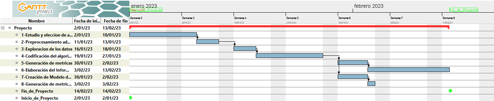

# Minería de reglas de asociación espaciales para búsqueda de patrones en escenarios #

## Código ASSOMINING ##

***Martín Cogo Belver***

## Proyecto ##

Este proyecto se enfocara en la prueba de un algoritmo para inferencia de *reglas de asociación* que ilustren los patrones de posicionamiento de objetos dentro de un escenario o espacio. Este tipo de problema es tratado por un area de las ciencias de la computación llamado *Minería de reglas de asociación espaciales*.

Del documento [Enhancing spatial association rule mining in geographic databases] se puede entender que trata de un problema de minería de reglas de asociación particular donde se trabaja desde el punto de vista de objetos que interaccionan entre si dentro de un espacio.  

En consecuencia de que la extracción de datos de la realidad es una tarea compleja, realizaré la inferencia de reglas de asociación espacial un mapa del videojuego Minecraft.  
Los mapas de Minecraft son generados mediante un proceso de generación procedural y están compuestos enteramente por cubos. Esto permite la fácil extracción de datos. La elección de este escenario fue inspirada en el proyecto [Minecraft Chunk Viewer].

Haciendo uso de la biblioteca [Anvil Parser] de Python para extraer la información de los bloques que componen el mapa del juego, se puede generar un archivo [CSV de Bloques]. Sobre este, realizara la inferencia de reglas que puedan representar los patrones y relaciones entre los distintos tipos de bloques.

## Objetivos ##  

1. Selección de un algoritmo apropiado para tratar el problema.
2. Generación de reglas de asociación espacial representativas de patrones evidentes y no tan evidentes dentro del escenario planteado.
3. Corroborar que un acercamiento al problema de detección de patrones utilizando reglas de asociación es un buen camino.
4. (Opcional) Generar un modelo capaz de verificar si las reglas de asociación se cumplen dentro de un escenario.

## Alcance y limitaciones ##

+ Este proyecto aporta sustento a un proyecto mucho mayor. Este consiste en la generación procedural de objetos dentro de un escenario respetando restricciones las cuales habrían sido inferidas de un escenario similar al que se desea generar.
+ Para este proyecto se quiere evitar entrar en problemas de computer vision para la extracción de los datos de entornos.
+ También, de ser posible, se quiere evitar la necesidad de generación manual de datos para la resolución del problema.  

## Métricas ##

Utilizare [Métricas para reglas de association].

+ Soporte: Mide la frecuencia con la que aparece en todas las transacciones.

$$
Support({X}\to{Y})  = \dfrac
{\text{Transaction containing X and Y}}
{\text{Total number of transactions}}
$$

+ Confianza: Mide la probabilidad de que aparezca el consecuente dado un antecedente.

$$
confidence({X}\to{Y})  = \dfrac
{\text{Transaction containing X and Y}}
{\text{Transactions containing X}}
$$

+ Sustentación: Calcula la probabilidad de ocurrencia del consecuente dado un antecedente.  

$$
Lift({X}\to{Y})  = \dfrac
{\dfrac{\text{Transaction containing X and Y}}
{\text{Transactions containing X}}}
{\text{Fraction of transactions containing Y}}
$$

## Justificación ##

Actualmente existen varios algoritmos que permiten la generación procedural de posicionamiento de objetos dentro de un  entorno. Pero estos utilizan restricciones declaradas por el programador. Encontrar y declarar estas restricciones presenta una tarea compleja y esto no permite que el posicionamiento de los objetos dentro del escenario tengan mucha libertad o variación.  

Por ello la idea del proyecto sería encontrar una manera de automatizar la generación de restricciones que utilizaría un algoritmo de generación procedural para el posicionamiento de los objetos dentro del escenario.

De ahí que sea necesario la utilización de un algoritmo de machine learning para la deducción de estas restricciones y detección de patrones. La detección de patrones en el posicionamiento de objetos dentro de un espacio, es un problema que puede presentarse con muchos escenarios distintos y con objetos distintos que los componen.  

## Listado de actividades a realizar ##

1. Estudio y análisis de bibliografía y recursos para la elección de un algoritmo apropiado. (7 días)
2. Preprocesamiento de los datos iniciales para generar predicados espaciales que se utilizaran a la hora de realizar la inferencia. (3 día)
3. Realizar gráficos de exploración de los datos de entrada y análisis.(3 día)
4. Codificación del algoritmo para inferencia de reglas propuesto. (7 días)
5. Generación de las métricas particulares para evaluar las reglas de asociación obtenidas.(4 día)
6. Elaboración del Informe final con los resultados obtenidos y conclusiones (7 días)

## Actividades tentativas ##

7. Creación de un modelo capaz de valuar si se cumplen un conjunto de reglas inferidas en un escenario. (7 días)
8. Generación de métricas adicionales a partir del modelo obtenido.(2 día)

## Cronograma Gantt estimado de actividades ##

## Bibliografía y Links ##

+ [Métricas para reglas de association]
+ [Anvil Parser]
+ [CSV de Bloques]
+ [Minecraft Chunk Viewer]
+ [Enhancing spatial association rule mining in geographic databases]

[Enhancing spatial association rule mining in geographic databases]:https://www.lume.ufrgs.br/handle/10183/7841
[Minecraft Chunk Viewer]:https://pessimistress.github.io/minecraft/
[CSV de Bloques]:Minecraft/chunkTest.csv
[Anvil Parser]:https://github.com/matcool/anvil-parser
[Métricas para reglas de association]:https://towardsdatascience.com/association-rules-2-aa9a77241654
