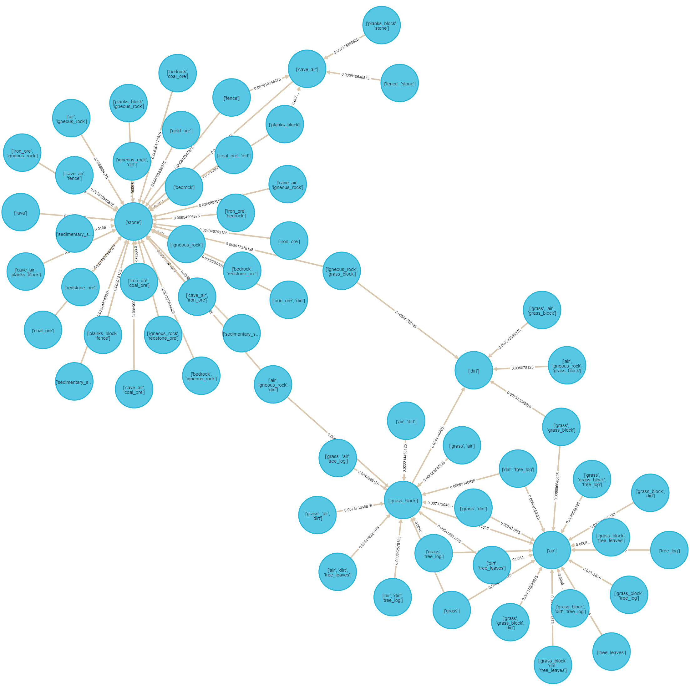
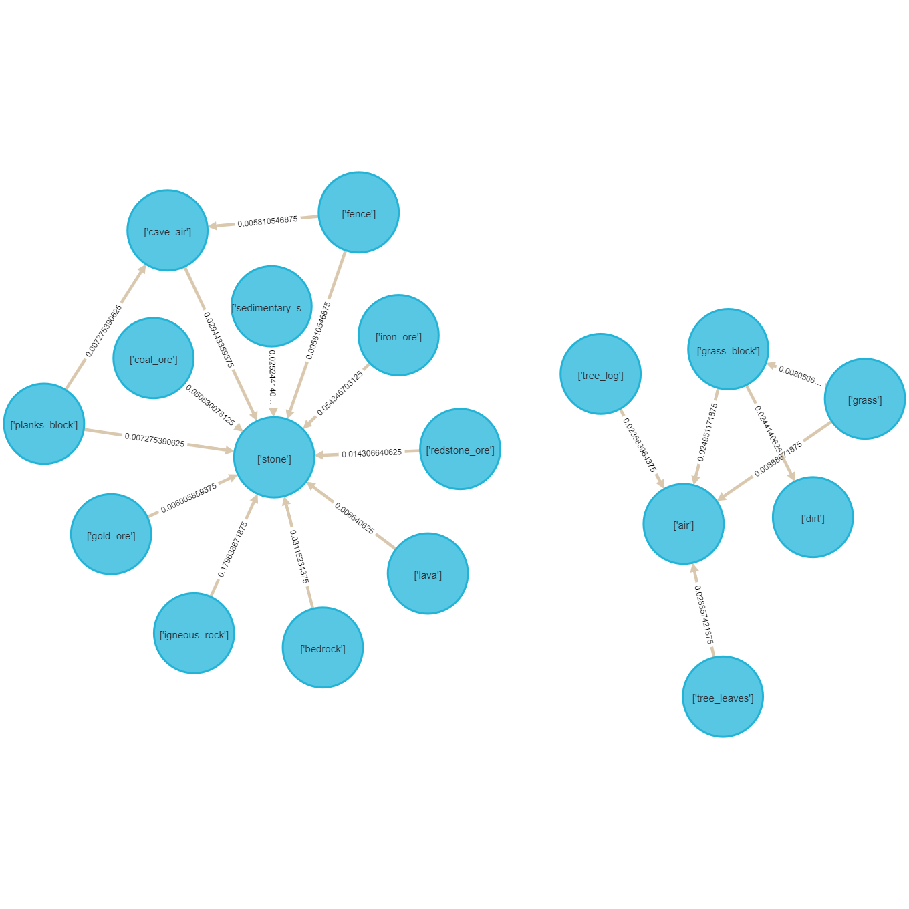
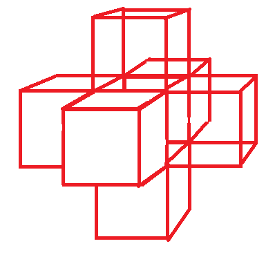
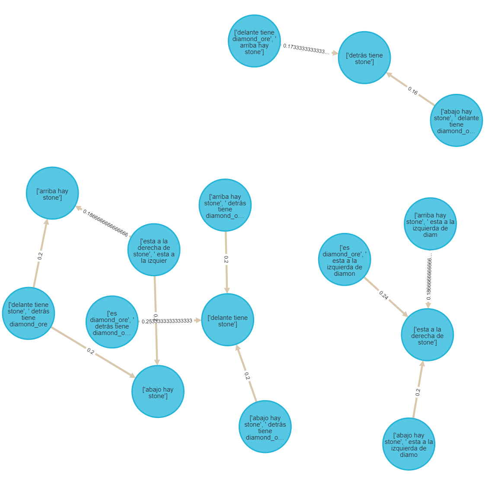

# Apéndice

En este documento se presentan temas relacionados o enfoques planteados que aportan al proyecto.  

## Indice

1. Apéndice Marco Teórico
    1. Chi-Square Test for Independence and Correlation
    2. Direction Setting Rules (reglas DS)
    3. Otros modelos apreciados que se utilizan para la minería de reglas de asociación
2. Apéndice Diseño Experimental
    1. Métrica lift
    2. mca file
3. Apéndice Resultado
    1. Detección de Outliers o datos espaciales apartados
    2. Lista de tipos de bloques presentes en el conjunto de datos
    3. Grafos de las reglas sin podado
        1. Transacciones de ventanas de 4x4x4 sin solapamiento
        2. Atributo de referencia **diamante**
        3. Atributo de referencia **hojas y troncos**
        4. Atributo de referencia **pasto**
        5. Combinación entre los modelos anteriores

## Apéndice Marco Teórico

### Chi-Square Test for Independence and Correlation

El método $X^2$ como estadístico de prueba es utilizado ampliamente para las pruebas de independencia o correlación. Esencialmente la prueba $X^2$ esta basada en la comparación de frecuencias observadas con la correspondiente frecuencia esperada. Mientras más cercana es la frecuencia observada a la esperada mayor es el peso de evidencia en favor de la independencia. Se trata de una prueba de hipótesis donde se utiliza el estadístico de bondad de ajuste.

En [Pruning and summarizing the discovered associations] se define:

- Definición 1: (correlaciones) Siendo $s$ el soporte mínimo y $c$ el nivel de significancia. $X$ e $y$ de la regla $X \to y$, se dice que $(s,c)$ están correlaciones si se cumplen las siguientes condiciones:
    1. El soporte $s$ de la regla excede
    2. El valor $X^2$ para la regla con respecto a el resto de los datos excede el valor $X^2$ a un nivel de $c$.

- Definición 2: (independiente) Siendo $s$ el soporte mínimo y $c$ el nivel de significacia. $X$ e $y$ de la regla $X \to y$, se dice que $(s,c)$ son independientes si se cumple:
    1. El soporte $s$ de la regla excede
    2. El valor de $X^2$ para la regla con respecto a el total de los datos no excede el valor $X^2$ a una significaría s.

- Definición 3: (tipo de correlación o dirección)
    1. Positive correlation: si $X$ e $y$ de una regla r $X\to y$ están correlacionados y $\frac{f_o}{f_e} > 1$, se dice que r tiene correlación positiva, se denota con 1 y decimos que la dirección de r es 1.
    2. Negative correlation: si $X$ e $y$ de una regla r $X\to y$ están correlacionados y $\frac{f_o}{f_e} < 1$, se dice que r tiene correlación negativa, se denota con -1 y decimos que la dirección de r es -1.
    3. Independencia: si $X$ e $y$ de una regla r $X\to y$ son independientes,se denota con 0 y decimos que la dirección de r es 0.

### Direction Setting Rules (reglas DS)

- Definición 4: (direction setting rule) Una regla $r$ es un $DS$ si satisface las siguientes condiciones:
    1. Tiene dirección positiva 1.
    2. Su dirección no es un elemento del conjunto de *direcciones esperadas*.

- Definición 5: (Direcciones esperadas) El conjunto *direcciones esperadas* de una regla r es definido como sigue:
    1. Si r es 1-condicional, el conjunto esperado de direcciones es {0}.
    2. Si r es k-condicional rule r ($k > 1$) de la forma:
        r: $a_1,a_2,...,a_k\to y$
    el conjunto de direcciones es computarizada como sigue:
    Vemos a r como una combinación de 2 reglas, una regla 1-condicional y una regla ($k-1$)-condicional con el mismo consecuente $y$:
        $$r_1: a_i \to y  r_{\text{rest}}: a_1,a_2,...,a_k \ to y$$
    donde $$\{a_1,a_2,...,a_j\}=\{a_1,a_2,...ma_k\}-\{a_i\}$$

Las direcciones esperadas para esta combinación, denotada por $E_i$, es definida como sigue:

1. **Si** ($r_1.dir=r_{\text{rest}}.dir=1$) **entonces** $E_i=1$.
2. **Si** ($r_1.dir=o \text{ y } r_{\text{rest}}.dir=1$) **o** ($r_1.dir=1 \text{ y } r_{\text{rest}}.dir=0$) **entonces** $E_i=1$.
3. **Si** ($r_1.dir=o \text{ y } r_{\text{rest}}.dir=1$) **o** ($r_1.dir=1 \text{ y } r_{\text{rest}}.dir=0$) **entonces** $E_i=1$.
4. **Si** ($r_1.dir=r_{\text{rest}}.dir=0$) **entonces** $E_i=0$.
5. **otherwise** $E_i=\text{unknown}$

**Lemma**: Todos las reglas 1-condicionales que son correlativas son reglas DS. La demostración se incluye en [Pruning and summarizing the discovered associations].

### Otros modelos apreciados que se utilizan para la minería de reglas de asociación  

1. **Event centric model**  
    Es relevante para aplicaciones donde hay muchos tipos de atributos espaciales booleanos. Se utiliza cuando es de interés encontrar subconjuntos de atributos espaciales probables a ocurrir en el vecindario alrededor de instancias dado subconjuntos de tipos de eventos.  
    Hay más detalles respecto a este modelado en [Discovering Spatial Co-location Patterns]  
      

    Más detalles en [Spatial Data Mining_ Theory and Application_Deren L., Shuliang W., Deyi L].

2. **Concept lattice**  

    El  lattice o (también llamado análisis de concepto) es un modelo para espacios grillados.En este contexto lattice hace referencia a una colección regular o irregular de lugares espaciales relacionados entre ci mediante una relación de vecindario. Un diagrama de Hasse simplemente visualiza la relación de generalización entre la intension y la extension de un concepto.  
    Comparado con el Algoritmo Apriori ,el concepto lattice reduce el numero de reglas de asociación redundantes, dando como resultado un mejor rendimiento.

    

3. **Cloud model**  

    En general, el conjunto frecuente de items de reglas de asociación espacial existen a un nivel conceptual alto, is difícil descubrirlas en un nivel conceptual bajo. En particular, cuando el atributo es numérico y la minería es sobre el nivel conceptual original. no se generan fuertes reglas de asociación si el soporte y confianza mínimo son grandes. En este caso los atributos necesitan ser elevándolas un nivel mediante generalización de atributos, y luego las reglas de asociación se deben generar sobre ellos. El modelo nube flexibiliza las particiones de atributos espaciales simulando  el lenguaje humano. Cada atributo es tratado como una variable lingüística.
    Luego de la generalización varias tuplas pueden combinarse si se vuelven idénticas a un nivel conceptual alto, lo cual reduce el tamaño de los datos significativamente. Luego de este preprocesamiento se utiliza el algoritmo *Apriori*.

    

## Apéndice Diseño Experimental

### Metrica Lift

- Sustentación: El indicador lift expresa cuál es la proporción del soporte observado de un conjunto de productos respecto del soporte teórico de ese conjunto dado el supuesto de independencia. Un valor de $lift = 1$ indica que existe independencia estadística entre el antecedente y el consecuente. Un valor de $lift > 1$ indica que ese conjunto aparece una cantidad de veces superior a lo esperado bajo condiciones de independencia. Un valor de $lift < 1$ indica que ese conjunto aparece una cantidad de veces inferior a lo esperado bajo condiciones de independencia.

$$
Lift({X}\to{Y})  = \dfrac{Confidence({X}\to{Y})}{Support(Y)}
$$

### mca file

La estructura de los archivos .mca se ve de esta manera:  
  
*(Se puede apreciar que la diferencia entre los archivos .mca nuevos y viejos no es notable en la estructura general de almacenamiento)*

El terreno que utilizare fue generado por la version 1.10.2 del videojuego. Debido a que la herramienta de [Visualización](http://pessimistress.github.io/minecraft/) funciona con mapas generados en versiones del juego anteriores a la 1.14, y el paseador de archivos *.mca* [Anvil Parser] funciona con versiones posteriores a la 1.14. Se genera conflicto con los archivos generados por el videojuego.

Para solucionar este inconveniente y no crear un visualizador o un parcer nuevo, generé un mundo y sus correspondientes archivos *.mca* en la version 1.10 y luego **utilizando el videojuego** realizo una conversion del mapa a la version 1.14. De esta manera trabajaremos con los archivos *.mca* de la nueva version guardados en la carpeta *region_new* y visualizaremos los mapas con los archivos *.mca* guardados en la carpeta *region_old*. En escencia el **contenido de los archivos .mca es el mismo**, con la diferencia de que desde la version 1.14 cambian algunas particularidades de como se almacena la información en los archivos .mca.

Para "parsear" estos archivos y extraer la información de los bloques en un archivo de región utilizaremos la biblioteca **anvil**. Una vez parseado guardaremos el chunk en formato .csv y utilizaremos la biblioteca **pandas** para trabajar y manipular los datos.

## Apéndice Resultados

### Detección de Outliers o datos espaciales apartados

Un *dato espacial aparatado* es un objeto especialmente referenciado cuyos atributos no-espaciales tienen valores que difieren significativamente de aquellos otros objetos que son vecinos. El análisis de datos aparatados resulta importante para el descubrimiento de patrones en los datos espaciales.

Existen dos tipos de métodos para la detección *valores apartados* en datos espaciales:

- **Graphical test** (Prueba gráfica): Métodos de ejemplo incluye el *variogram cloud* y el *Moran scatterplots*.  
- **Quantitative test** (Prueba cuantitativa): proveen una prueba precisa para la distinción de los datos apartados. los *Scatterplots* son representativos de esta técnica.  

Un **variogram-cloud** muestra puntos de datos relacionados por una relación de vecindad. por cada par de localizaciones, se plotea la raíz cuadrada de la diferencia absoluta entre los valores de los atributos de las localizaciones contra la distancia Euclideana entre las localizaciones. En conjuntos de datos que exhiben una fuerte dependencia espacial, la varianza en la diferencia entre atributos incrementara a medida que incrementa la distancia entre localizaciones. Localizaciones que están cercanas una de la otra, pero tienen gran diferencia en sus atributos, deberían indicar un dato apartado, incluso si los valores de ambas localizaciones puedan aparentar ser razonables cuando se examinan los datos no espaciales.

  

- Debido a que los vecindarios, ventanas o en este caso *chunks* se encuentran de manera equidistante entre si, no es util utilizar métodos que sirven para la detección de datos apartados teniendo en cuenta el espacio. Debido a que las distancias entre dos bloques se tienden a repetir se puede ver que hay un patron en la distribución de los puntos en los gráficos. Pero no es claro donde existen datos apartados y donde no.  

### Lista de tipos de bloques presentes en el conjunto de datos

Lista de tipos de bloque:

['bedrock' 'stone' 'gold_ore' 'diorite' 'andesite' 'coal_ore' 'dirt' 'grass_block' 'air' 'oak_log' 'oak_leaves' 'iron_ore' 'granite' 'redstone_ore' 'lava' 'gravel' 'dark_oak_leaves' 'grass' 'cave_air' 'dark_oak_log' 'oak_planks' 'oak_fence' 'lapis_ore' 'cobweb' 'rail' 'poppy' 'water' 'red_mushroom_block' 'diamond_ore' 'mushroom_stem'
'spawner' 'red_mushroom' 'infested_stone' 'emerald_ore' 'obsidian' 'sand''clay' 'spruce_leaves' 'spruce_log' 'dandelion' 'brown_mushroom_block' 'peony' 'sugar_cane' 'tall_seagrass' 'seagrass']

Claramente se aprecia en el gráfico que se trata de un conjunto de datos desbalanciados ya que los bloques de aire, piedra y tierra tienen frecuencias mucho más altas que todos los otros tipos, es de esperarse entonce que el soporte soporte de las reglas generadas a partir de estos tipos sean muy altos.

### Grafos de las reglas sin podado

#### Transacciones de ventanas de 4x4x4 sin solapamiento

  

#### Atributo de referencia **diamante**

  

#### Atributo de referencia **hojas y troncos**

  

#### Atributo de referencia **pasto**

  

#### Combinación entre los modelos anteriores

  

------------------------------------------------------------------------------------------------------------------
#### Window centirc model

##### Transacciones de ventanas de 4x4x4 sin solapamiento

Las transacciones para en este caso son ventanas de 4x4x4 es decir cubos de 64 bloques. Para la generación de estas reglas pasamos como parámetro un soporte mínimo de tal manera que solo considere aquellas reglas que se presentan mas de **100** veces  y una confianza de 90%.  

  

Podemos observar que se trata de un grafo totalmente conexo, donde cada nodo representa un antecedente o consecuente de una regla. Al tratarse de un grafo muy grande y cantidad de reglas es grande. Resulta muy difícil analizarlo. Simplemente podemos marcar algunos pequeños clusters que se forman alrededor de nodos particulares, los cuales se puede apreciar que siempre tienen un solo tipo de bloque, ej. air,dirt, water o stone.

  

Este grafo es el resultado del post-procesamiento y se trata de las reglas que forman el direction setting set o DS. Estas son las reglas que representan y dan dirección a la mayoría de las demás reglas que se encuentran en non-DS rules. El análisis resulta sencillo en este grafo.
Podemos ver entonces los siguientes patrones:

Claramente estas reglas no se encuentran en el conjunto de reglas DS pero si representan bien todas las posibles variaciones que pueden formarse (varios de ellos se encuentran en el conjunto non_DS).

Observando las primeras reglas podemos ver que la confianza es muy alta en todas pero el soporte no necesariamente. Esto se interpreta como que el consecuente ocurre muy frecuentemente cuando el antecedente se cumple pero ambos antecedente y antecedente ocurren poco frecuentemente juntos en la misma venta.(De todas maneras el soporte es tan bajo debido a la enorme cantidad de bloques y lo desbalanceado que se encuentra el conjunto de bloques). Sin embargo podemos asegurar que cada una de estas reglas ocurre almeno 100 veces o más.

    id           antecedants      =>      consequents   support  confidence  
    0            ['coal_ore']  ['=>']        ['stone']  0.050830    1.000000   
    1                ['lava']  ['=>']        ['stone']  0.006641    1.000000   
    2         ['tree_leaves']  ['=>']          ['air']  0.028857    1.000000   
    3               ['grass']  ['=>']  ['grass_block']  0.008057    0.906593   
    4         ['grass_block']  ['=>']         ['dirt']  0.024414    0.902527   
    5            ['iron_ore']  ['=>']        ['stone']  0.054346    1.000000   
    6   ['sedimentary_stone']  ['=>']        ['stone']  0.025244    0.966355   
    7            ['tree_log']  ['=>']          ['air']  0.023584    0.997934   
    8            ['cave_air']  ['=>']        ['stone']  0.029443    0.982085   
    9         ['grass_block']  ['=>']          ['air']  0.024951    0.922383   
    10       ['planks_block']  ['=>']        ['stone']  0.007275    1.000000   
    11           ['gold_ore']  ['=>']        ['stone']  0.006006    1.000000   
    12              ['fence']  ['=>']        ['stone']  0.005811    1.000000   
    13              ['fence']  ['=>']     ['cave_air']  0.005811    1.000000   
    14       ['redstone_ore']  ['=>']        ['stone']  0.014307    1.000000   
    15       ['igneous_rock']  ['=>']        ['stone']  0.179639    0.997019   
    16              ['grass']  ['=>']          ['air']  0.008887    1.000000   
    17       ['planks_block']  ['=>']     ['cave_air']  0.007275    1.000000   
    18            ['bedrock']  ['=>']        ['stone']  0.031152    1.000000

- En este conjunto se encuentran todas las demás reglas que podrían ser relevantes aun que su análisis nos revelaría que las reglas son combinaciones de todas las reglas anteriores.

- Aun asi no hay que desmerecer la importancia de los patrones que pueden hallarse en este grafo aunque sean de difícil interpretación debido a su cantidad.

Cabe destacar que existen patrones que ocurren menos de 100 veces y que resultan importantes por ejemplo

- Si hay *piedra* y *lava* y *agua* **entonces** hay *obsidiana*.

Esto nos lleva a pensar que definir una cantidad minima de veces para que aparezca un patron no es tal vez la mejor forma de encarar el problema.

Realmente este enfoque para modelar las transacciones no nos resulta de gran interés, ya que simplemente nos muestra que bloque existe en una ventada dado que otro existe en ella. Si bien es notorio que existe un patron, no podemos saber claramente como es el patrón claramente.
Entonces el **windows centric model** no es un modelo que nos permita obtener las reglas que se buscan.

#### Reference feature centric model

Transacciones con ventanas de la forma cruz con 7 bloques, se pueden visualizar de la siguiente manera:  
  
Con este tipo de modelado de transacciones podemos obtener reglas que tienen una forma más cercana a las reglas que esperamos generar.

##### Atributo de referencia **diamante**

En este caso con el debido análisis se pueden detectar ciertos patrones al rededor de los bloques de diamante. Si bien la idea era considerar que un patrón es valido si ocurre más de 100 veces en este caso solo hay *75* bloques de diamante por lo que es necesario bajar la cantidad. Asumimos entonces que la cantidad minima de veces es **12**.

  

Podemos observar que se trata de un grafo totalmente conexo. Se puede observar que todos los nodos tienden a estar conectados con el item [es diamond_ore] y esto tiene sentido pues es aquel item que esta presente en todas las transacciones.

En las cuatro esquinas se puede ver que están los items [delante tiene stone], [detras tiene stone], [a la derecha de stone] y [a la izquierda de stone], lo cual nos hace entender que también esta presente en varias transacciones. Es decir, los diamante tienden a estar rodeados de piedras.

  

En este caso las reglas que tienden a representar el resto de las reglas son 4 todas con una confianza alta y un lift que indica una correlación positiva. Estas reglas nos indican que existe una relación o patrón fuerte entre el diamante y la piedra,

                            antecedants      =>    consequents   support  confidence      lift 
    0            ['detrás tiene diamond_ore']  ['=>']  ['delante tiene stone']  0.253333    0.791667  1.696429
    1               ['abajo hay diamond_ore']  ['=>']  ['arriba hay stone']  0.186667    0.823529  1.470588
    2  ['esta a la izquierda de diamond_ore']  ['=>']  ['esta a la derecha de stone']  0.240000    0.857143  1.648352 
    3           ['delante tiene diamond_ore']  ['=>']  ['detrás tiene stone']  0.253333    0.791667  1.562500 

Mirando este grafo notamos que todas pueden ser generadas tranquilamente por con las 4 reglas del conjunto DS. Y no nos aportan mayor información.

#### Atributo de referencia **hojas y troncos**

En este caso trabajaremos con bloques de tipo tronco y hojas, para centrarnos al crear las transacciones.

  

Se ven que hay clusters alrededor de los items [arriba hay tree_leaves], [es tree_leaves], [abajo hay tree_log] , [es tree_log] y [arriba hay tree_log]. La idea de este análisis es obtener el patron que hay al generar arboles.  

  

                                antecedants      =>              consequents  
    0               ['arriba hay tree_leaves']  ['=>']       ['es tree_leaves']   0.455034    0.905123  1.181455
    1                       ['abajo hay dirt']  ['=>']          ['es tree_log']   0.023935    1.000000  4.275491
    2            ['delante tiene tree_leaves']  ['=>']       ['es tree_leaves']   0.547047    0.923572  1.205537
    3     ['esta a la derecha de tree_leaves']  ['=>']       ['es tree_leaves']   0.546787    0.918159  1.198471
    4             ['detrás tiene tree_leaves']  ['=>']       ['es tree_leaves']   0.547047    0.923032  1.204831
    5                  ['arriba hay tree_log']  ['=>']          ['es tree_log']   0.185153    0.982513  4.200724
    6   ['esta a la izquierda de tree_leaves']  ['=>']       ['es tree_leaves']   0.546787    0.925301  1.207793
    7                        ['abajo hay air']  ['=>']       ['es tree_leaves']   0.251930    0.922515  1.204157
    8                       ['abajo hay dirt']  ['=>']  ['arriba hay tree_log']   0.023935    1.000000  5.306489
    9                ['abajo hay tree_leaves']  ['=>']       ['es tree_leaves']   0.455034    0.992810  1.295912
    10                      ['arriba hay air']  ['=>']       ['es tree_leaves']   0.307085    0.996623  1.300889

Se ven claro los patrones en este conjunto:  

- El patrón que indica que si hay un bloque de tierra abajo se trata de un tronco y arriba tiene otro tronco.
- El patrón que indica que si hay una hoja esta rodeada de hojas y que arriba puede haber aire.

Llama la atención que los troncos y las hojas no estén relacionados de ninguna manera.

 

En este resto de reglas se puede ver los patrones:

- El patrón que indica que los troncos pueden estar rodeados de aire o rodeados por alguna hoja o tronco.
- El patrón de que las hojas están rodeadas de otras hojas arriba tienen aire y en algún costado un tronco.

#### Atributo de referencia **pasto**

En el caso de los bloques de pasto la cantidad minima de patrones que se debe encontrar es de **200**, el soporte mínimo se define en función de esto.

  

Se puede ver que los las reglas tienden a relacionarse con 3 items en particular son: [es grass_block], [abajo hay dirt] y [arriba hay air].

Esto muestra un claro patron que indica que para que haya un bloque de tierra con pasto, debajo tiene más tierra y por arriba tiene bloques de aire.

  

Se puede apreciar el patrón antes mencionado en este conjunto resumido de reglas:

                                antecedants      =>         consequents  support  confidence      lift
    0            ['esta a la derecha de air']  ['=>']  ['abajo hay dirt']   0.096421    1.000000  1.011576 
    1                      ['arriba hay air']  ['=>']  ['abajo hay dirt']   0.888483    0.989962  1.001422 
    2                   ['delante tiene air']  ['=>']  ['arriba hay air']   0.146822    0.949606  1.058066
    3  ['esta a la izquierda de grass_block']  ['=>']  ['abajo hay dirt']   0.605308    0.991623  1.003103
    4            ['detrás tiene grass_block']  ['=>']  ['abajo hay dirt']   0.573655    0.993255  1.004753
    5          ['esta a la izquierda de air']  ['=>']  ['arriba hay air']   0.158997    0.956076  1.065275
    6                   ['detrás tiene dirt']  ['=>']  ['arriba hay air']   0.174093    0.934641  1.041391 
    7           ['esta a la derecha de dirt']  ['=>']  ['arriba hay air']   0.175554    0.926735  1.032583
    8         ['esta a la izquierda de dirt']  ['=>']  ['abajo hay dirt']   0.138787    0.976027  0.987326

Este grafo nos muestra que el bloque de pasto tiende a estar rodeado de otros bloques de pasto o tierra sin pasto.

Esta claro que el patrón donde arriba de una grass_block aparecen flores tiene una frecuencia muy pequeña como para que aparezca en las reglas, pero aún así se trata de un patrón totalmente valido y no descubierto. Esto nos hace pensar si realmente estamos tomando un acercamiento correcto  al problema.

#### Combinación entre los modelos anteriores

Con los resultados obtenidos mediante los dos modelos anteriores, uno tendería querer combinar la forma que toman las reglas como resultado de el *reference feature centric model* y aplicarlo en todo el espacio como con el *window centric model*.

Debido a que la cantidad de tiempo necesario para generar las ventanas en cruz para cada bloque del mapa es grande, nos de dictaremos a el análisis y exploración de las reglas generadas para un solo chunk que son un total de $16x16x256 = 65536$  bloques.

Por lo tanto generaremos las transaccione para todos los bloques con ventanas tipo cruz que se superpondrán en todo el espacio.

La cantidad minima de patrones que se necesitaran para considerarlo valido es **200**.

Se ven un cluster donde se relacionan los items con bloques de aire, por otro lado los que se relacionan con bloques de piedra, un cluster relacionado a las igneous_rocks (arena,arcilla o grava) y otro gran cluster relacionado con tierra.
