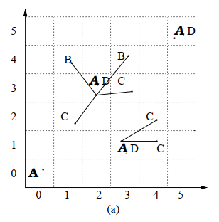
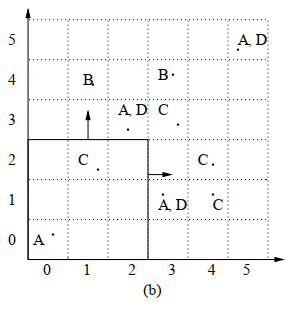
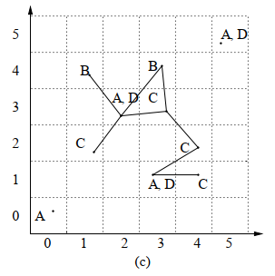
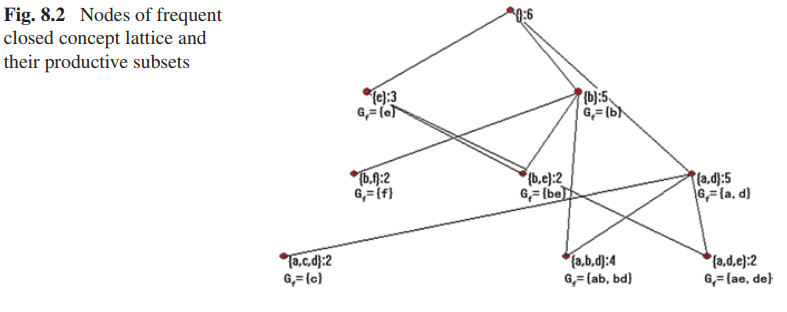
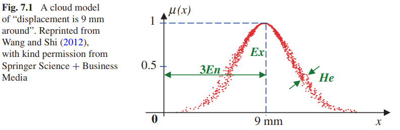
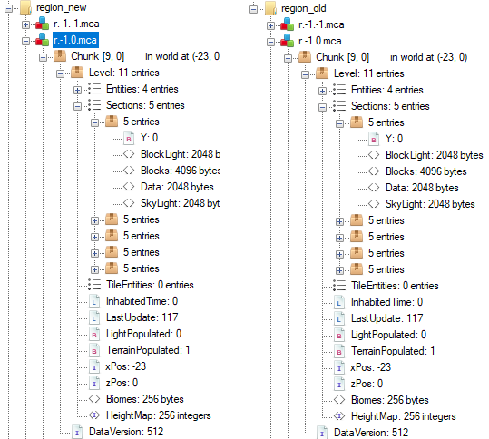
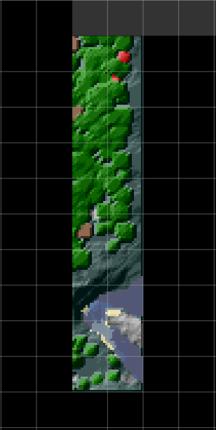

# Minería de reglas de asociación espacial sobre Minecraft

## El Proyecto

Este proyecto tiene como objetivo la resolución de algún problema en particular y la justificación de la solución utilizando algoritmos de Inteligencia Artificial.

El problema que se eligió para este proyecto se puede explicar de la siguiente manera:

Dentro de la industria de creación de videojuegos existe un area grande e importante que consiste en la generación procedural. Se le llama generación procedural de contenido, o **PCG** (*Procedural Content Generation*) por sus siglas en ingles, a la creación algorítmica de contenido para videojuegos con entradas del usuario limitadas o indirectas. [Procedural Content Generation in Games].
Dentro de este area existen varios algoritmos que permiten la generación de contenido a partir de el establecimiento de parámetros de entrada que permiten al Diseñador orientar el funcionamiento del algoritmo. Teniendo en cuenta esta característica surge la pregunta:  

- ¿Sería posible mediante un algoritmo de inteligencia artificial y un entorno (artificial o natural), poder *inferir* parámetros para que un algoritmo de **PCG** genere entornos similares?  

O de otra manera:

- ¿Puedo ***inferir las relaciones*** que existen entre los objetos de un entorno dado y, a partir de ellos, establecer parámetros para un algoritmo de generación procedural?

Debido a la extension de un proyecto que abarque el procedimiento completo desde la obtención de los datos de un entorno hasta la generación de otro entorno mediante algún algoritmo *PCG* para contestar estas preguntas, se decidió que el enfoque del proyecto este en la búsqueda y comparación de algoritmos de inteligencia artificial que permitan la descripción, aprendizaje o inferencia de las relaciones que existen entre objetos en un espacio natural,artificial,físico o virtual.

Con la exploración bibliográfica se puede entender que existe un area de investigación dentro de la ciencia en minería de datos que enfocada en como realizar las tareas de minería de datos sobre bases de datos espaciales o geográficas. La **Minería de Datos Espaciales** o **SDM** es un proceso de descubrimiento y extracción de conocimiento generalizado sobre gran cantidad de datos espaciales. [Spatial Data Mining_ Theory and Application_Deren L., Shuliang W., Deyi L].

El proyecto entonces consistirá en la aplicación de algunas técnicas y algoritmos utilizados en el area de *Spatial Data Mining* para poder describir u obtener las relaciones entre objetos espaciales en un entorno. Como la obtención de datos de un entorno real, resulta complejo, y el enfoque inicial pretende abstraerse de objetos concretos, se opta por elegir un entorno practico para el proyecto. Concretamente, el entorno es una porción de mapa del Videojuego *Minecraft*.

*Minecraft* es un videojuego con gráficos 3D que utiliza un complejo procedimiento de generación procedural para la creación de terrenos de juego utilizando cubos. Principalmente es elegido debido a que los datos correspondientes a un terreno generado en el videojuego son de fácil acceso, fácil generación y la extracción de es sencilla, además, la disposición de los objetos dentro del juego son bloques con coordenadas rectangulares, es decir que el entorno esta grillado. Se puede obtener mas información sobre el procedimiento de generación procedural en está pagina web: [The World Generation of Minecraft].

### El trabajo

Los enfoques tomados para la *búsqueda de patrones*, según [Discovering Spatial Co-location Patterns],en datos espaciales se dividen en dos ramas:

- Los métodos basados en **estadística espacial** utilizan medidas de correlación espacial para caracterizar las relaciones entre los diferentes tipos de atributos espaciales. Computar las medidas de correlación espacial para todo posible patron de co-localización puede ser computacionalmente caro debido al numero exponencial de candidatos dado una gran cantidad de atributos espaciales.

- El enfoque basado en **reglas de association** se concentra en la creación de transacciones booleanas sobre el espacio de tal manera que se pueda usar el algoritmo ***apriori***.***(Estos son de nuestro interés para la resolución del problema)***

Con la exploración bibliográfica en libros como [Data Mining and Knowledge Discovery Handbook] y [Spatial Data Mining_ Theory and Application_Deren L., Shuliang W., Deyi L] podemos entender que relacionados con la tarea de la minería de datos existen modelos predictivos y descriptivos. Con el análisis del problema entendemos que los modelos con un enfoque descriptivo que podríamos utilizar son los modelos de Clustering o las Reglas de asociación.

En este trabajo optamos por el enfoque mediante un modelo de Reglas de Asociación. Si entendemos un poco más del entorno podemos notar que se encuentra totalmente generado por bloques de distinto tipo y cuyo posicionamiento cumple con un patron que nosotros buscamos descubrir a lo largo del trabajo. Si se utilizara un algoritmo de clustering los resultados que obtendríamos son grupos de bloques que son similares y no es el tipo de respuesta que se busca para la solución al problema.  

Teniendo en cuenta que el resultado esperado es un modelo que permita entender como se relaciona la posición de un bloque con la posición de otro bloque, se eligió el enfoque de Reglas de Asociación que esta basado principalmente en el algoritmo **Apriori**. Por lo tanto en este trabajo se generaran reglas de asociación con este algoritmo y se generaran gráficos que ilustren y permitan el análisis de resultados y obtención de una conclusion.

## Apriori Y Métricas

Con la investigación de la bibliografía sobre el area de Minería de datos espaciales [Spatial Data Mining_ Theory and Application_Deren L., Shuliang W., Deyi L] se nos brinda una definición formal del problema de minar datos transaccionales para generar reglas de asociación.

### Definición formal del problema

Sea $I = \{i_1,...,i_n\}$ un conjunto de *items*. Al conjunto que contiene *k* items se le llama conjunto *k* de items.  

Si $A \subseteq I,B \subseteq I$ y $A \cap B = \empty$, entonces las regla de asociación es una implicación de la forma $A \rightarrow B$.  

$D$ es el conjunto de datos transaccionales relevantes para la tarea de minería.Cada transacción $T$ con un identificador $TID$ es el conjunto permitiendo $T \subseteq I$.  

Un conjunto de items ***frecuente*** es uno donde la frecuencia de ocurrencia de los items no es menor que el **soporte mínimo** establecido y no menor que el numero de transaccionen de $D$.

El algoritmo *Apriori* utiliza información en conjuntos de items *frecuentes* para generar reglas de asociación. La idea básica es buscar en el conjunto de datos transaccionales varias veces para determinar los *conjuntos de items frecuentes*. Cada búsqueda después de la primera, tiene la prioridad de generar conjuntos de datos frecuentes candidato a partir del ultimo conjunto de datos frecuentes obtenido. La información a priori es utilizada para generar el primer conjunto frecuente.

### Métricas

- Soporte: Mide la frecuencia con la que aparece en cada transacción. Se trata de la probabilidad de que aparezca X o Y en las transacciones.
$$
Support({X}\to{Y})  = \dfrac
{\text{Transaction containing X and Y}}
{\text{Total number of transactions}}
$$

- Confianza: Mide la probabilidad de que aparezca el consecuente dado un antecedente.

$$
Confidence({X}\to{Y})  = \dfrac
{\text{Transaction containing X and Y}}
{\text{Transactions containing X}}
$$

- Sustentación: El indicador lift expresa cuál es la proporción del soporte observado de un conjunto de productos respecto del soporte teórico de ese conjunto dado el supuesto de independencia. Un valor de $lift = 1$ indica que ese conjunto aparece una cantidad de veces acorde a lo esperado bajo condiciones de independencia. Un valor de $lift > 1$ indica que ese conjunto aparece una cantidad de veces superior a lo esperado bajo condiciones de independencia (por lo que se puede intuir que existe una relación que hace que los productos se encuentren en el conjunto más veces de lo normal). Un valor de $lift < 1$ indica que ese conjunto aparece una cantidad de veces inferior a lo esperado bajo condiciones de independencia (por lo que se puede intuir que existe una relación que hace que los productos no estén formando parte del mismo conjunto más veces de lo normal).

$$
Lift({X}\to{Y})  = \dfrac{Confidence({X}\to{Y})}{Support({X}\to{Y})}
$$

## Enfoques para el modelado de transacciones

Los problemas de co-localización espacial se ven similares a los clásicos pero de hecho son diferentes debido a la ausencia de transacciones.En el problema de minería de reglas de co-localización espacial, las transacciones son implícitas y además son disjuntos en el sentido de que no comparten instancias de tipos de item. Las instancias de atributos espaciales booleanos están embebidos en el espacio y comparten una variedad de relaciones espaciales unas con otras.

A partir de los los leído en el paper [Discovering Spatial Co-location Patterns], entendemos que en la minería de reglas de asociación existen casos especiales donde al menos uno de los predicados es espacial, lo cual nos lleva a la tarea de minería de reglas de asociación espacial. Si el descubrimiento de reglas de asociación espacial es restringido a un atributo de referencia, entonces las transacciones pueden ser definidas alrededor de instancias de este atributo. Generalizar este paradigma al caso donde no hay un atributo de referencia no es trivial. Una alternativa es la definición de transacciones particionando del espacio, aun que esto puede llevar al descuento de instancias de tuplas que intersecting los limites de las transacciones artificiales o recuentan instancias de tuplas que se encuentran juntas.  

En [Discovering Spatial Co-location Patterns] se definen dos términos para facilitar la descripción de los modelos.

- Una **co-localización** es un subconjunto de atributos espaciales booleanos.

- Una **regla de co-localización** es de la forma $C_1 \rightarrow C_2(p,cp)$ donde $C_1$ y $C_2$ son co-localizaciones, $p$ es un numero representando la medida de predominio y $cp$ es un numero que mide la probabilidad condicionada.

### Modelos para transacciones basadas en co-localización

Con el fin de tomar el conjunto de datos espaciales obtenidos compuesto por coordenadas rectangulares y modificarlos para que sirvan de entrada para el algoritmo **Apriori**. Se pretende utilizar algunos de los modelos siguientes.

#### Modelos

1. **Reference feature centric model**  
Es relevante para aplicaciones enfocadas en un atributo espacial booleano. El modelo enumera los *vecindarios* para "materializar" un conjunto de transacciones al rededor de instancias del atributo espacial de interés.  
Al "materializar" transactions, el **soporte** y la **confianza** de la minería tradicional son usados como *predominio* y medidas de *probabilidad condicionada*.  
  
En la imagen lo ques e puede apreciar es que siendo A el atributo de referencia, B y C los atributos relevantes, Entonces por cada atributo A se genera una transacción que depende de los B y los C cercanos o relativos. 
2. **Window centric model**  
Es relevante para aplicaciones que se enfocan en parcelas de territorio. Un objetivo es predecir un conjuntos de atributos espaciales que es probable descubrir en una parcela dado que se han encontrado otros atributos en el. El modelo enumera todas las posibles ventanas como transacciones.En espacios discretizados por grillas uniformes, las ventanas de $kxk$ se pueden materializar ignorando el efectos de limites. El **soporte** y la **confianza** se usan como *predominio* y medidas de *probabilidad condicionada*.
En este caso discretizando con un raster o grilla se generan particiones del terreno, e infinitas particiones pueden obtenerse con si se permite el solapamiento de ventanas.  
  
Se puede ver en la imagen una ventana de $3x3$ que tiene atributos A y C.
3. **Event centric model**  
Es relevante para aplicaciones donde hay muchos tipos de atributos espaciales booleanos. Se utiliza cuando es de interés encontrar subconjuntos de atributos espaciales probables a ocurrir en el vecindario alrededor de instancias dado subconjuntos de tipos de eventos.  
Hay más detalles respecto a este modelado en [Discovering Spatial Co-location Patterns]  
  

#### Otros modelos apreciados que se utilizan para la minería de reglas de asociación  

Más de talles de estos en [Spatial Data Mining_ Theory and Application_Deren L., Shuliang W., Deyi L].

1. **Concept lattice**  
El  lattice o (también llamado análisis de concepto) es un modelo para espacios grillados.En este contexto lattice hace referencia a una colección regular o irregular de lugares espaciales relacionados entre ci mediante una relación de vecindario. Un diagrama de Hasse simplemente visualiza la relación de generalización entre la intension y la extension de un concepto.  
Comparado con el Algoritmo Apriori ,el concepto lattice reduce el numero de reglas de asociación redundantes, dando como resultado un mejor rendimiento.

2. **Cloud model**  
En general, el conjunto frecuente de items de reglas de asociación espacial existen a un nivel conceptual alto, is difícil descubrirlas en un nivel conceptual bajo. En particular, cuando el atributo es numérico y la minería es sobre el nivel conceptual original. no se generan fuertes reglas de asociación si el soporte y confianza mínimo son grandes. En este caso los atributos necesitan ser elevándolas un nivel mediante generalización de atributos, y luego las reglas de asociación se deben generar sobre ellos. El modelo nube flexibiliza las particiones de atributos espaciales simulando  el lenguaje humano. Cada atributo es tratado como una variable lingüística.
Luego de la generalización varias tuplas pueden combinarse si se vuelven idénticas a un nivel conceptual alto, lo cual reduce el tamaño de los datos significativamente. Luego de este preprocesamiento se utiliza el algoritmo *Apriori*.

### Modelos para el trabajo

De todos los anteriores modelos, para este caso de aplicaciones solo tres son de nuestro interés. El **Reference feature centric model** que nos permite tomar un bloque en particular como atributo de referencia y generar reglas de asociación de el, el **Windows centric model** que nos resulta de muy fácil aplicación debido a que el mapa del videojuego ya se encuentra grillado en 3 dimensiones. Y (de manera tentativa), el **Cloud model** debido a que nos permite de alguna manera tomar el dominio de las coordinas rectangulares y generar expresarlo en lenguaje natural.

## Obtención de los datos del Videojuego
Para extraer la información sobre los bloques de Minecraft utilizare la información brindada por esta pagina web:[Minecraft Region file format](https://minecraft.fandom.com/wiki/Region_file_format). 

En la capeta de instalación del videojuego encontramos una carpeta donde se guarda la información cada mundo generado llamada ``saves``. Dentro de la carpeta del mundo encontramos la sub-carpeta ``region``. Esta carpeta contiene varios archivos con formato *.mca*. Los archivos *.mca* tienen un patron de nombramiento que depende de las regiones del juego que se han generado, por cada region generada existe un archivo que contiene la información de 32x32 *chunks*. Siendo *x* y *z* las coordenadas de una región los archivos se nombran como *r.x.z.mca*.

Cada *Chunk* guarda el terreno, las entidades en un area de 16x16x256 donde el ancho y largo es 16 y la altura es 256. Además guarda iluminación precomputalizada, mapas de altura y otra información que no es de nuestro interés. La estructura de los archivos .mca se ve de esta manera:  
  
*(Se puede apreciar que la diferencia entre los archivos .mca nuevos y viejos no es notable en la estructura general de almacenamiento)*

El terreno que utilizare fue generado por la version 1.10.2 del videojuego. Debido a que la herramienta de [Visualización](http://pessimistress.github.io/minecraft/) funciona con mapas generados en versiones del juego anteriores a la 1.14, y el paseador de archivos *.mca* [Anvil Parser](https://github.com/matcool/anvil-parser) funciona con versiones posteriores a la 1.14. Se genera conflicto con los archivos generados por el videojuego.

Para solucionar este inconveniente y no crear un visualizador o un parcer nuevo, generé un mundo y sus correspondientes archivos *.mca* en la version 1.10 y luego **utilizando el videojuego** realizo una conversion del mapa a la version 1.14. De esta manera trabajaremos con los archivos *.mca* de la nueva version guardados en la carpeta *region_new* y visualizaremos los mapas con los archivos *.mca* guardados en la carpeta *region_old*. En escencia el **contenido de los archivos .mca es el mismo**, con la diferencia de que desde la version 1.14 cambian algunas particularidades de como se almacena la información en los archivos .mca.

Para "parsear" estos archivos y extraer la información de los bloques en un archivo de región utilizaremos la biblioteca **anvil**. Una vez parseado guardaremos el chunk en formato .csv y utilizaremos la biblioteca **pandas** para trabajar y manipular los datos.

## Análisis de Datos de Obtenidos

A diferencia de el punto de vista de la minería de datos clásica, donde el conjunto de datos esta compuesto columnas llamados Atributos y cada linea llamada transacción, al trabajar con datos espaciales cada linea se interpreta como una entidad u objeto en el espacio y cada columna puede ser un atributo no espacial o un atributo espacial.

En este caso particular podemos ver que los atributos no espaciales son el **Tag** que es prácticamente el nombre del tipo de bloque que hay en el mapa y el atributo **Bid** que es un id de bloque relativo al *chunk* en el que está.

Los demás atributos resultan ser coordenadas rectangulares donde **cx** y **cz** son coordenadas en dos dimensiones que indican la posición del *chunk* al cual pertenece el bloque. Y los atributos **(X,Y,Z)** corresponden a las coordenadas rectangulares locales que indican el posicionamiento del bloque en su *chunk*. Todos estos atributos son espaciales y describen el objeto que en este caso es un bloque.

El mapa en el juego se ve de está manera:

  

Esta parte del mapa tiene algunas particularidades que son notables:
  
Se puede observar que cruza una pequeña porción de agua que esta rodeada por piedas, arena y grava. Corresponde con una pequeña parte de un río generado en el mapa.   
  
La porción del terreno cubierta con arboles tiene 3 tipos: 
Los de madera clara son robles, los de madera obscura son arboles de roble obscuro y ademas se pueden observar hongos grandes rojos y uno marron.  

  
Se pueden que en las capas inferiores pequeñas cuevas y lo que se conoce como una *grieta* en el juego. A mayor profundidad se puede observar mayor cantidad de minerales y bloques distintos a la piedra. En el ultimo nivel se puede ver que están los bloques denominados bedrock que delimitan el final del terreno y no pueden ser traspasados por los jugadores.

### Lista de tipos de bloques presentes en el conjunto de datos

***DATOS***  
***IMAGENES***

### Distribución de los bloques de aire en el mapa

***DATOS***  
***IMAGENES***

### Distribución de la lava y el agua en el mapa

***DATOS***  
***IMAGENES***

### Distribución de tierra y arboles en el mapa

***DATOS***  
***IMAGENES***

## Detección de Outliers o datos espaciales apartados

Un *dato espacial aparatado* es un objeto especialmente referenciado cuyos atributos no-espaciales tienen valores que difieren significativamente de aquellos otros objetos que son vecinos. El analis de datos aparatados resulta importante para el descubrimiento de patrones en los datos espaciales.

Existen dos tipos de métodos para la detección *valores apartados* en datos espaciales:
- **Graphical test** (Prueba gráfica): Metodos de ejemplo incluye el *variogram cloud* y el *Moran scatterplots*.
- **Quantitative test** (Prueba cuantitativa): proveen una prueba precisa para la distinción de los datos apartados. los *Scatterplots* son representativos de esta técnica.

Un **variogram-cloud** muestra puntos de datos relacionados por una relación de vecindad. por cada par de localizaciones, se plotea la raíz cuadrada de la diferencia absoluta entre los valores de los atributos de las localizaciones contra la distancia Euclideana entre las localizaciones. En conjuntos de datos que exhiben una fuerte dependencia espacial, la varianza en la diferencia entre atributos incrementara a medida que incrementa la distancia entre localizaciones.
Localizaciones que están cercanas una de la otra, pero tienen gran diferencia en sus atributos, deberían indicar un dato apartado, incluso si los valores de ambas localizaciones puedan aparentar ser razonables cuando se examinan los datos no espaciales.

***DATOS***
***IMAGENES***

## Creación de transacciones a partir de datos espaciales

### Window centirc model

#### Transacciones de ventanas de 4x4x4 sin solapamiento

***DATOS***
***IMAGENES***

### Reference feature centric model

Transacciones con ventanas de la forma cruz con 7 bloques

#### Atributo de referencia **diamante**

***DATOS***
***IMAGENES***

#### Atributo de referencia **hojas y troncos**

***DATOS***
***IMAGENES***

#### Atributo de referencia **pasto**

***DATOS***
***IMAGENES***

## Resultados y Conclusión

- ?

## Bibliografía y Papers relacionados  

## Fuentes Primarias

### Data Mining

- [Data Mining and Knowledge Discovery Handbook]

[Data Mining and Knowledge Discovery Handbook]:https://link.springer.com/book/10.1007/b107408

### Spatial Data Mining

- [Spatial Data Mining_ Theory and Application_Deren L., Shuliang W., Deyi L]

[Spatial Data Mining_ Theory and Application_Deren L., Shuliang W., Deyi L]:https://link.springer.com/book/10.1007/978-3-662-48538-5

- [Discovering Spatial Co-location Patterns]

[Discovering Spatial Co-location Patterns]:https://link.springer.com/chapter/10.1007/3-540-47724-1_13

## Fuentes Secundarios

### Association Rules mining

- [Métricas para reglas de association](https://towardsdatascience.com/association-rules-2-aa9a77241654)
- [Priori en R](https://www.geeksforgeeks.org/association-rule-mining-in-r-programming/#:~:text=Association%20Rule%20Mining%20in%20R%20Language%20is%20an%20Unsupervised%20Non,in%20a%20transaction%20or%20relation.)
- [Lista de algoritmos para minería de reglas de asociación](https://personal.ntu.edu.sg/assourav/Unpublished/UP-ARMSurvey.pdf)

### Spacial Association Rules mining

- [Enhancing spatial association rule mining in geographic databases](https://www.lume.ufrgs.br/handle/10183/7841)
- [POWERPOINT Spatial Association Rules](https://www.ismll.uni-hildesheim.de/lehre/spatial-09w/script/association_web.pdf)
- [Papers del Power anterior](http://www.spatial.cs.umn.edu/paper_list.html)
- [SPADA system for spatial association rules mining on spatial databases](https://edz.bib.uni-mannheim.de/www-edz/pdf/eurostat/02/KS-CS-02-001-EN-N-EN.pdf#page=26)
- [Discovering spatial interaction patterns of near repeat crime by spatial association rules mining](https://www.nature.com/articles/s41598-020-74248-w)
- [Exploring spatial data](https://libraries.mit.edu/files/gis/exploring_spatial_patterns_iap2013.pdf)

### Procedural generation

- [Procedural Content Generation in Games]

[Procedural Content Generation in Games]:https://link.springer.com/book/10.1007/978-3-319-42716-4

### Minecraft related content

- [The World Generation of Minecraft]
[The World Generation of Minecraft]:https://www.alanzucconi.com/2022/06/05/minecraft-world-generation/
- [JS chunk visualizer](https://pessimistress.github.io/minecraft/)
- [I Wrote a 3D Chunk Visualizer for Minecraft](https://www.youtube.com/watch?v=fpGsOdxcU2M&ab_channel=ParametricCamp)
- [An easy to use and fast Minecraft world viewer](https://unmined.net)
- [enkiMI Minecraft 3D editor](https://www.reddit.com/r/VoxelGameDev/comments/8c4a67/a_better_way_to_extract_minecraft_data/)
- [Minecraft Region file format](https://minecraft.fandom.com/wiki/Region_file_format)
- [Minecraft Region file Wikipedia](https://wiki.vg/Region_Files)
- [Formato NBT](https://minecraft.fandom.com/es/wiki/Formato_NBT)
- [Anvil Parser](https://github.com/matcool/anvil-parser)
