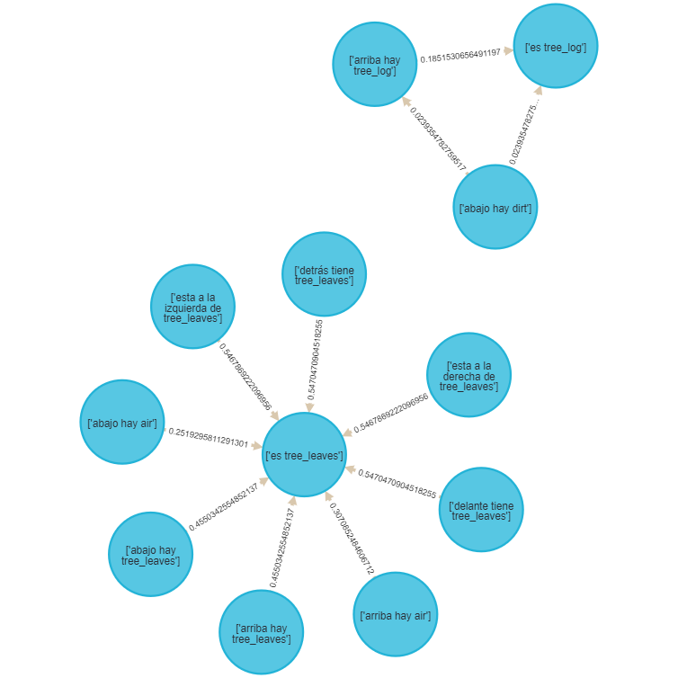
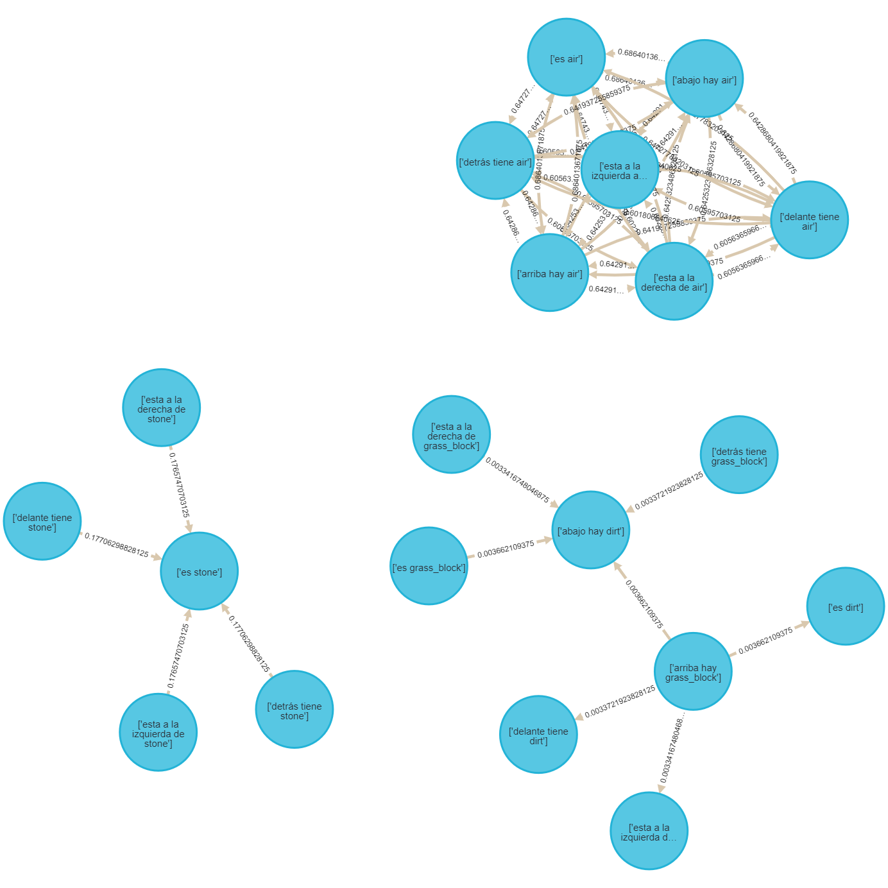

# Minería de reglas de asociación espacial sobre Minecraft

***Martín Cogo Belver***  

***Inteligencia Artificial I - Cursado 2022***

***Informe final***

***Facultad de Ingeniería Universidad de Cuyo***

## Introducción

Este proyecto tiene como objetivo la resolución de algún problema en particular y la justificación de la solución utilizando algoritmos de Inteligencia Artificial.

El problema que se eligió para este proyecto se puede explicar de la siguiente manera:

Dentro de la industria de creación de videojuegos existe un area grande e importante que consiste en la generación procedural. Se le llama generación procedural de contenido, o **PCG** (*Procedural Content Generation*) por sus siglas en ingles, a la creación algorítmica de contenido para videojuegos con entradas del usuario limitadas o indirectas. [Procedural Content Generation in Games].
Dentro de este area existen varios algoritmos que permiten la generación de contenido a partir de el establecimiento de parámetros de entrada que permiten al Diseñador orientar el funcionamiento del algoritmo. Teniendo en cuenta esta característica surge la pregunta:  

- ¿Sería posible mediante un algoritmo de inteligencia artificial y un entorno (artificial o natural), poder *inferir* parámetros para que un algoritmo de **PCG** genere entornos similares?  

O de otra manera:

- ¿Puedo ***inferir las relaciones*** que existen entre los objetos de un entorno dado y, a partir de ellos, establecer parámetros para un algoritmo de generación procedural?

Debido a la extension de un proyecto que abarque el procedimiento completo desde la obtención de los datos de un entorno hasta la generación de otro entorno mediante algún algoritmo *PCG* para contestar estas preguntas, se decidió que el enfoque del proyecto este en la búsqueda y comparación de algoritmos de inteligencia artificial que permitan la descripción, aprendizaje o inferencia de las relaciones que existen entre objetos en un espacio natural,artificial,físico o virtual.

Con la exploración bibliográfica se puede entender que existe un area de investigación dentro de la ciencia en minería de datos que enfocada en como realizar las tareas de minería de datos sobre bases de datos espaciales o geográficas. La **Minería de Datos Espaciales** o **SDM** es un proceso de descubrimiento y extracción de conocimiento generalizado sobre gran cantidad de datos espaciales. [Spatial Data Mining_ Theory and Application_Deren L., Shuliang W., Deyi L].

El proyecto entonces consistirá en la aplicación de algunas técnicas y algoritmos utilizados en el area de *Spatial Data Mining* para poder describir u obtener las relaciones entre objetos espaciales en un entorno. Como la obtención de datos de un entorno real, resulta complejo, y el enfoque inicial pretende abstraerse de objetos concretos, se opta por elegir un entorno practico para el proyecto. Concretamente, el entorno es una porción de mapa del Videojuego *Minecraft*.

*Minecraft* es un videojuego con gráficos 3D que utiliza un complejo procedimiento de generación procedural para la creación de terrenos de juego utilizando cubos. Principalmente es elegido debido a que los datos correspondientes a un terreno generado en el videojuego son de fácil acceso, fácil generación y la extracción de es sencilla, además, la disposición de los objetos dentro del juego son bloques con coordenadas rectangulares, es decir que el entorno esta grillado. Se puede obtener mas información sobre el procedimiento de generación procedural en está pagina web: [The World Generation of Minecraft].

### Propuesta

Los enfoques tomados para la *búsqueda de patrones*, según [Discovering Spatial Co-location Patterns],en datos espaciales se dividen en dos ramas:

- Los métodos basados en **estadística espacial** utilizan medidas de correlación espacial para caracterizar las relaciones entre los diferentes tipos de atributos espaciales. Computar las medidas de correlación espacial para todo posible patron de co-localización puede ser computacionalmente caro debido al numero exponencial de candidatos dado una gran cantidad de atributos espaciales.

- El enfoque basado en **reglas de association** se concentra en la creación de transacciones booleanas sobre el espacio de tal manera que se pueda usar el algoritmo ***apriori***.***(Estos son de nuestro interés para la resolución del problema)***

Con la exploración bibliográfica en libros como [Data Mining and Knowledge Discovery Handbook] y [Spatial Data Mining_ Theory and Application_Deren L., Shuliang W., Deyi L] podemos entender que relacionados con la tarea de la minería de datos existen modelos predictivos y descriptivos. Con el análisis del problema entendemos que los modelos con un enfoque descriptivo que podríamos utilizar son los modelos de Clustering o las Reglas de asociación.

En este trabajo optamos por el enfoque mediante un modelo de Reglas de Asociación. Si entendemos un poco más del entorno podemos notar que se encuentra totalmente generado por bloques de distinto tipo y cuyo posicionamiento cumple con un patron que nosotros buscamos descubrir a lo largo del trabajo. Si se utilizara un algoritmo de clustering los resultados que obtendríamos son grupos de bloques que son similares y no es el tipo de respuesta que se busca para la solución al problema.  

Teniendo en cuenta que el resultado esperado es un modelo que permita entender como se relaciona la posición de un bloque con la posición de otro bloque, se eligió el enfoque de Reglas de Asociación que esta basado principalmente en el algoritmo **Apriori**. Por lo tanto en este trabajo se generaran reglas de asociación con este algoritmo y se generaran gráficos que ilustren y permitan el análisis de resultados y obtención de una conclusion.

## Marco Teórico

### Minería de reglas de asociación

La minería de datos, en especial la generación de reglas de asociación, tiene como objetivo el reconocimiento de patrones en los datos.

En el libro [Spatial Data Mining_ Theory and Application_Deren L., Shuliang W., Deyi L] se nos introducen algunas definiciones útiles para describir el problema de generación de reglas de asociación:

Sea $I = \{i_1,...,i_n\}$ un conjunto de *items*. Al conjunto que contiene $k$ items se le llama conjunto $k$ de items. Si $A \subseteq I,B \subseteq I$ y $A \cap B = \empty$, entonces las regla de asociación es una implicación de la forma $A \rightarrow B$. $D$ es el conjunto de datos transaccionales relevantes para la tarea de minería. Cada transacción $T$ con un identificador $TID$ es el conjunto permitiendo $T \subseteq I$.  

*Un conjunto de items ***frecuente*** es uno donde la frecuencia de ocurrencia de los items no es menor que el **soporte mínimo** establecido y no menor que el numero de transaccionen de $D$.*

Los pasos a realizar para la generación de reglas de asociación son:

1. Preparar el conjunto de datos. (Pre-procesamiento)
2. Seleccionar el **soporte mínimo** y la **confianza minima**.
3. Encontrar todos los conjuntos de items frecuentes cuyo soporte no es menor que el **soporte mínimo** establecido.
4. Generar todas las reglas cuya confianza no sea menor que la **confianza minima** establecida.
5. Ajustar el limite de **soporte mínimo** y **confianza minima** para generar más reglas o menos reglas dependiendo de la cantidad generada.
6. Refinar las reglas de asociación de interés utilizando conocimiento profesional pa entender las reglas. (Post-procesamiento)

Para encarar el problema propuesto en este proyecto se eligió el algoritmo **Apriori**, un algoritmo que se relaciona con la **Inteligencia Artificial** porque es un algoritmo de **Machine Learning**.

#### Algoritmo Apriori para minería de reglas de asociación

  
Fig.1 - Algoritmo Apriori.

El algoritmo *Apriori* tomado de [Discovering Spatial Co-location Patterns]  utiliza información en conjuntos de items *frecuentes* para generar reglas de asociación. La idea básica es buscar en el conjunto de datos transaccionales varias veces para determinar los *conjuntos de items frecuentes*. Cada búsqueda después de la primera, tiene la prioridad de generar conjuntos de datos frecuentes candidato a partir del ultimo conjunto de datos frecuentes obtenido. La información *a priori* es utilizada para generar el primer conjunto frecuente. El algoritmo itera hasta que el tamaño del conjunto de items frecuentes candidato no tenga conjuntos cuyo soporte es mayor que el establecido.

##### Motivos para su elección

La elección de este algoritmo se realizo teniendo en cuenta que es el algoritmo más sencillo de entender y que es mostrado como principal herramienta para la generación de reglas de asociación. Existen otros algoritmos y técnicas para realizar la minería de reglas de asociación, pero algunos resultan complejos o son mejoras del algoritmo **Apriori** . Debido al poco conocimiento que tengo en el campo, me resulta como una opción valida. Esta elección nos lleva a adaptar el problema para la utilización de **Apriori**.

Hay que tener en cuenta que **Apriori** tiene sus puntos débiles:  

1. En el proceso de generar los *k conjuntos de items frecuentes* de los candidatos, el conjunto de datos es recorrido varias veces. Si la base de datos es muy grande esto resulta ineficiente.
2. Cuando las reglas de asociación son extraídas, es importante calcular todos los subconjuntos del conjunto de *items frecuentes* lo cual añade complejidad temporal.
3. Muchas reglas redundantes son generadas. (Una posible solución a esto es la técnica **Concept Lattice**)

#### Entrada y modelado de transacciones

El algoritmo **Apriori** recibe de entrada un conjunto de datos transaccionales. Es decir que el conjunto de datos debe estar compuesto por transacciones. Una transacción se interpreta de distintas maneras según el contexto del problema. Por ejemplo, el conjunto de ventas de una sucursal esta compuesta de transacciones, en cada transacción podemos ver que tipo de productos lleva un cliente.

Los problemas de co-localización espacial se ven similares a los clásicos (como el de ventas de una sucursal) pero, de hecho, son diferentes debido a la ausencia de transacciones. En el problema de minería de reglas de co-localización espacial, las transacciones son implícitas y además son disjuntos en el sentido de que no comparten instancias de tipos de item. Las instancias de atributos espaciales booleanos están embebidos en el espacio y comparten una variedad de relaciones espaciales unas con otras.

A partir de los los leído en el paper [Discovering Spatial Co-location Patterns], entendemos que en la minería de reglas de asociación existen casos especiales donde al menos uno de los predicados es espacial, lo cual nos lleva a la tarea de minería de reglas de asociación espacial. Si el descubrimiento de reglas de asociación espacial es restringido a un atributo de referencia, entonces las transacciones pueden ser definidas alrededor de instancias de este atributo. Generalizar este paradigma al caso donde no hay un atributo de referencia no es trivial. Una alternativa es la definición de transacciones particionando del espacio, aun que esto puede llevar al salteado de instancias que intersectan los limites de las transacciones artificiales o cuentan instancias de tuplas que se encuentran juntas.  

En [Discovering Spatial Co-location Patterns] se definen dos términos para facilitar la descripción de los modelos.

- Una **co-localización** es un subconjunto de atributos espaciales booleanos.

- Una **regla de co-localización** es de la forma $C_1 \rightarrow C_2(p,cp)$ donde $C_1$ y $C_2$ son co-localizaciones, $p$ es un numero representando la medida de predominio y $cp$ es un numero que mide la probabilidad condicionada.

##### Modelos para transacciones basadas en co-localización

Con el fin de tomar el conjunto de datos espaciales obtenidos compuesto por coordenadas rectangulares y modificarlos para que sirvan de entrada para el algoritmo **Apriori**. Se pretende utilizar algunos de los modelos siguientes:

1. **Reference feature centric model**  
    Es relevante para aplicaciones enfocadas en un atributo espacial booleano. El modelo enumera los *vecindarios* para "materializar" un conjunto de transacciones al rededor de instancias del atributo espacial de interés.  
    Al "materializar" transactions, el **soporte** y la **confianza** de la minería tradicional son usados como *predominio* y medidas de *probabilidad condicionada*.  

      
    Fig.2 - Reference feature centric model  

    En la **Fig.2** lo ques e puede apreciar es que siendo A el atributo de referencia, B y C los atributos relevantes, Entonces por cada atributo A se genera una transacción que depende de los B y los C cercanos o relativos.  

2. **Window centric model**  
    Es relevante para aplicaciones que se enfocan en parcelas de territorio. Un objetivo es predecir un conjuntos de atributos espaciales que es probable descubrir en una parcela dado que se han encontrado otros atributos en el. El modelo enumera todas las posibles ventanas como transacciones.En espacios discretizados por grillas uniformes, las ventanas de $kxk$ se pueden materializar ignorando el efectos de limites. El **soporte** y la **confianza** se usan como *predominio* y medidas de *probabilidad condicionada*.
    En este caso discretizando con un raster o grilla se generan particiones del terreno, e infinitas particiones pueden obtenerse con si se permite el solapamiento de ventanas.  
    
      
    Fig.3 - Window centric model  
    
    En la **Fig.3** puede ver en la imagen una ventana de $3x3$ que tiene atributos A y C.

***En el apéndice pueden verse otras formas de modelar transacciones***

#### Análisis de Reglas de asociación

La evaluación de reglas de asociación mediante las métricas **soporte** y **confianza** generalmente decantan en el caso en el que la regla es bien conocida o trivial, o en el caso en el que se generan gran cantidad de variantes de una misma regla con valores similares de confianza y soporte.

En el libro [Data Mining and Knowledge Discovery Handbook] se nos proveen enfoques para atacar este problema de los cuales nos interesa uno:

##### Búsqueda de reglas de interés

Para empezar, la decisión final de si una regla es de interés o no, la realiza un experto. Las métricas constantemente retornan reglas como las más interesantes si tienen un solo item en el consecuente, porque en este caso la confianza se maximiza. Pero el usuario podría no estar interesado en diferentes items o combinaciones en el consecuente. Por eso el interés subjetivo de estas reglas puede ser bajo en algunas aplicaciones. En efecto, todas las medidas de interés se sustentan en propiedades estadísticas y no tienen en cuenta la información de fondo. El experto toma en cuenta reglas que resultan de interés pero no son distinguibles de las demás por sus métricas.  

El algoritmo procesa las reglas descubiertas nivel por nivel, desde el nivel 1 al nivel n (donde n es la cantidad de atributos en el antecedente de una regla). Por cada regla r en un nivel particular el algoritmo hace lo siguiente:

La función compDir computa el tipo de correlación (o dirección) de la regla r dado dos reglas r y R, en la linea 2 R = “→ y” ya que esto equivale a comparar r con todas las demás reglas del conjunto $F$.

Si r es de nivel 1 y su correlación es positiva se incluye en DS sino se poda y guardamos la regla  r es podado po "→ y". (esta información puede ser de ayuda para el experto)

En la linea 6 se procesa r utilizando todo par de ancestros $r_1$ y $r_\text{rest}$.
En la linea 7 si r ya se ha podado no puede ser parte del cojunto DS, entonces se salta el bucle.

En la linea 8, si no se sale del bucle, se realiza la evaluación de poda en el método evalPrune.
En la linea 10-21, si no se ha podado r en linea 8, pasa a verificar si la regla pertenece a DS o no-DS evaluando todas las combinaciones de direcciones o correlaciones entre cada para r_1 r_rest.

y en caso de que r pertenezca al conjunto DS r.justify escribe los conjuntos (r_1,r_rest) que justifican su pertenencia.

Luego de completar el bucle for, si r.justify ≠ ∅, r pertenece a las reglas DS. Sin embargo

##### Podando reglas de asociación

Para facilitar la tarea de exploración de reglas de asociación en este proyecto en [Pruning and summarizing the discovered associations] se utiliza la correlación estadística para definir direcciones de una regla, y en función de ellas realizar una poda de reglas para remover aquellas reglas insignificantes.  

El conjunto de reglas no podadas se llama *direction settings* (DS) *rules*, y debido a las pruebas en la practica, resulta ser un conjuntos de reglas pequeños. Las **reglas DS** da un resumen del comportamiento de las reglas descubiertas. Estas representan las relaciones esenciales del dominio.

  
Fig.4 - Figura que muestra el proceso de poda y de resumen de reglas  

Dos puntos importantes:

1. En la definición de reglas $DS$ y $\text{no-DS}$, no se menciono como están relacionadas con el podado. Claramente, aquellas reglas podadas no se incluirán en el conjunto de reglas $DS$ o $no-DS$.

2. Para el fácil entendimiento el algoritmo se presenta como un método de pos-procesamiento pero puede incluirse durante la generación de reglas.

  
Fig.5 - Algoritmo de Poda y Resumen de reglas P-DS.  

El algoritmo de la **Fig.5** realiza la poda y la búsqueda de reglas $DS$ y $\text{no-DS}$. Los parámetros de entrada son $F$ y $T$, donde $F$ es el conjunto de reglas de asociación encontradas y $T$ es el valor $X^2$ con un nivel de significaría particular.

Se procesan las reglas descubiertas nivel por nivel, desde el nivel 1 al nivel n (donde n es la cantidad de atributos en el antecedente de una regla). Por cada regla r en un nivel particular el algoritmo hace lo siguiente:

En la linea 2 : La función **compDir** computa el tipo de correlación (o dirección) de la regla r dadas dos reglas r y R. R = “→ y” equivale a comparar r con todas las demás reglas del conjunto $F$.  
En la linea 3-5: Si r es de nivel 1 y su correlación es positiva se incluye en DS sino se poda y guardamos la regla  r es podado por "→ y". (esta información puede ser de ayuda para el experto)  
En la linea 6: Se procesa r utilizando todo par de ancestros $r_1$ y $r_\text{rest}$.  
En la linea 7: Si r ya se ha podado no puede ser parte del conjunto DS, entonces se salta el bucle.  
En la linea 8: Si no se sale del bucle, se realiza la evaluación de poda en el método evalPrune.  
En la linea 10-21: Si no se ha podado r en linea 8, pasa a verificar si la regla pertenece a DS o no-DS evaluando todas las combinaciones de direcciones o correlaciones entre cada para r_1 r_rest. En caso de que r pertenezca al conjunto DS r.justify escribe los conjuntos (r_1,r_rest) que justifican su pertenencia.  

Luego de completar el bucle for, si r.justify ≠ ∅, r pertenece a las reglas DS. Sin embargo, si r puede ser podada, entonces no es parte de las reglas DS. Se establece r.dir = undefined para que después r pueda ser utilizado como una regla que justifique otras en el futuro. Si r no pudo ser podada entonces es una regla DS. Todas las demás reglas no podadas y que no están en DS son parte del conjunto no-DS.

  
Fig.6 - Procedimiento compDir.  

En **Fig.6**:  
En la linea 2-5: Si χ2(r, R) > T, se rechaza la asumpción de independencia, determina el tipo de correlación o dirección. “r.cover*(R.sup/R.cover)” es la frecuencia esperada y x.cover es el numero de transacciones donde se satisface el antecedente de r.

  
Fig.7 - Procedimiento evalPrune.  

En **Fig.7**:  
La función evalPrune intenta podar r utilizando r_rest.
En linea 1, si r_rest en si misma ha sido podada previamente. Entonces, el algoritmo necesita encontrar la regla que podo a r_rest. Esto se muestra en la linea 2. En la linea 3 y 4, si r no representa una correlación positiva, se poda. 
Se establece r.prune= r_rest para proveer un enlace a la poda de reglas de mayor nivel que r. En la linea 5, si r tiene correlación positiva , entonces se intenta comparar con r_rest utilizando la prueba chi cuadrada. Si r no muestra correlación positiva, con el subconjunto de datos cubierto por r_rest es entonces podada por r_rest.

Se puede encontrar una detallada descripción del algoritmos en [Pruning and summarizing the discovered associations].

## Diseño Experimental

Por cada experimento que se realiza en el proyecto los pasos a realizados son:

1. Pre-procesamiento de los datos de entrada para generar transacciones.
2. Correr el Algoritmo Apriori con los datos transaccionales.
3. Tomar las reglas de asociación y realizar una poda mediante el algoritmo y clasificación en los conjuntos de reglas DS y No-DS.
4. Generar grafos a mano de los conjuntos de reglas resultantes.

Los experimentos solo difieren en la generación de transacciones, es decir que cambia la fase de pre-procesamiento. Los experimentos son:

De todos los anteriores modelos, para este caso de aplicaciones solo  utilizaremos. El **Reference feature centric model** que nos permite tomar un bloque en particular como atributo de referencia y generar reglas de asociación de el, el **Windows centric model** que nos resulta de muy fácil aplicación debido a que el mapa del videojuego ya se encuentra grillado en 3 dimensiones.

1. Windows centric model
    1. Transacciones con ventanas de 4x4x4.
2. Reference feature centric model  
    1. Transacciones centradas en el atributo **diamond**. (Diamante)  
    2. Transacciones centrada en el atributo **grass_block**. (bloques de pasto)  
    3. Transacciones centradas en el atributo **tree_log y tree_leaves**. (troncos y hojas)  
    4. Transacciones centradas en todos los atributos de un **chunk**. (todos los posibles bloques)

### Métricas

Para evaluar las reglas utilizaremos las siguientes métricas:

- Soporte: Se trata de la probabilidad de que aparezca X e Y en las transacciones.
$$
Support({X}\to{Y})  = \dfrac
{\text{Transaction containing X and Y}}
{\text{Total number of transactions}}
$$

- Confianza: Mide la probabilidad de que aparezca el Y dado que en una transacción aparece X.

$$
Confidence({X}\to{Y})  = \dfrac
{\text{Transaction containing X and Y}}
{\text{Transactions containing X}}
$$

### Elección de parámetros de Apriori

El algoritmo Apriori necesita como entrada un soporte mínimo y una confianza minima para poder filtrar los posibles conjuntos de items generados.

`Soporte mínimo`  
Voy a considerar en este trabajo que una patron es un patron valido si este aparece como mínimo un total de $X$ veces o más. Este $X$ sera arbitrario y lo decidiré en función de la cantidad de transacciones y el tipo de bloque o bloques o Atributo que se este evaluando. Con esto podremos calcular el soporte mínimo en función del la cantidad de transacciones en el conjunto de entrada.

Debido a que el conjunto de bloques del juego se encuentra desbalanciado *(la cantidad de bloques de aire, piedra y tierra tienen frecuencias altas comparado a los demás bloques)*, el soporte tiende a ser pequeño si queremos involucrar a varios tipos de bloques distintos de otra manera, las reglas generadas no mostrarían las relaciones que existen entre aquellos bloque que menos hay en el mapa, y  el enfoque de nuestro problema lo que buscamos es encontrar la mayor cantidad de relaciones entre los objetos del mapa posible. (Aun que esto nos trae también muchas reglas redundantes de aquellos bloques que más aparecen en el conjunto)

`Confianza mínima`  
Utilizamos una confianza alta ya que al tratarse de una generación aleatoria no todos las relaciones que existen se repetirán lo suficiente como para que sean patrones validos. La confianza nos indica que tan probable es que ocurra el consecuente dado que se cumple el antecedente. Necesitamos entonces que este valor sea alto para poder asegurarnos que realmente es un patrón y no una coincidencia. Elegiré entonces un valor de confianza del 90%.

### Obtención de los datos del Videojuego

Para extraer la información sobre los bloques de Minecraft utilizare la información brindada por esta pagina web : [Minecraft Region file format](https://minecraft.fandom.com/wiki/Region_file_format).  

En la capeta de instalación del videojuego encontramos una carpeta donde se guarda la información cada mundo generado llamada ``saves``. Dentro de la carpeta del mundo encontramos la sub-carpeta ``region``. Esta carpeta contiene varios archivos con formato *.mca*. Los archivos *.mca* tienen un patron de nombramiento que depende de las regiones del juego que se han generado, por cada region generada existe un archivo que contiene la información de 32x32 *chunks*. Siendo *x* y *z* las coordenadas de una región los archivos se nombran como *r.x.z.mca*.

Cada *Chunk* guarda el terreno, las entidades en un area de 16x16x256 donde el ancho y largo es 16 y la altura es 256. Además guarda iluminación precomputalizada, mapas de altura y otra información que no es de nuestro interés.  

Para "parsear" estos archivos y extraer la información de los bloques en un archivo de región utilizaremos la biblioteca [Anvil Parser]. Una vez parseado guardaremos el chunk en formato .csv y utilizaremos la biblioteca **pandas** de python para trabajar y manipular los datos.

### Análisis de Datos de Entrada

La información extraída del videojuego tiene la siguiente forma:

                Bid   X    Y   Z      Tag  CX  CZ
    0            1   0    0   0  bedrock   0   0
    1            2   0    1   0  bedrock   0   0
    2            3   0    2   0  bedrock   0   0
    3            4   0    3   0    stone   0   0
    4            5   0    4   0    stone   0   0
    ...        ...  ..  ...  ..      ...  ..  ..
    1310715  65532  15  251  15      air   1   9
    1310716  65533  15  252  15      air   1   9
    1310717  65534  15  253  15      air   1   9
    1310718  65535  15  254  15      air   1   9
    1310719  65536  15  255  15      air   1   9

En este caso particular podemos ver que los atributos no espaciales son el **Tag** que es prácticamente el nombre del tipo de bloque que hay en el mapa y el atributo **Bid** que es un id de bloque relativo al *chunk* en el que está.

Los demás atributos resultan ser coordenadas rectangulares donde **cx** y **cz** son coordenadas en dos dimensiones que indican la posición del *chunk* al cual pertenece el bloque. Y los atributos **(X,Y,Z)** corresponden a las coordenadas rectangulares locales que indican el posicionamiento del bloque en su *chunk*. Todos estos atributos son espaciales y describen el objeto que en este caso es un bloque.

#### Vistas del conjunto de bloques de entrada

  
Fig.8 - Vista en planta de los chunks  
  
Fig.9 - Vista del lado derecho del mapa  
  
Fig.10 - Vista del lado izquierdo del mapa  

##### Particularidades del conjunto de bloques

  
Fig.11 - Río en el mapa.  

En la **Fig.11** se ve que cruza una pequeña porción de agua que esta rodeada por piedras, arena y grava. Corresponde con una pequeña parte de un río generado en el mapa.  

  
Fig.12 - Algunos arboles del bosque que hay en el mapa.  

En la **Fig.12** la porción del terreno cubierta con arboles tiene 3 tipos. Los de madera clara son robles, los de madera obscura son arboles de roble obscuro y ademas se pueden observar hongos grandes rojos y uno marron.  

  
Fig.13 - Minerales bajo tierra.  

En la **Fig.13** en el ultimo nivel se puede ver que están los bloques denominados bedrock que delimitan el final del terreno y no pueden ser traspasados por los jugadores (color notablemente mas obscuro que los demás bloques).

  
Fig.14 - Cuevas y Grieta  bajo tierra.  

En la **Fig.14** en las capas inferiores del mapa hay pequeñas cuevas y lo que se conoce como una *grieta* en el juego (En la **Fig.14** a la izquierda). A mayor profundidad se puede observar mayor cantidad de minerales y bloques distintos a la piedra.

#### Lista de tipos de bloques presentes en el conjunto de datos

Lista de tipos de bloque:

Fig.15 - Frecuencias por cada tipo de bloque.  

- Claramente se aprecia en **Fig.15** que se trata de un conjunto de datos desbalanciados ya que los bloques de aire, piedra y tierra tienen frecuencias mucho más altas que todos los otros tipos, es de esperarse entonce que el soporte soporte de las reglas generadas a partir de estos tipos sean muy altos.

#### Distribución de los bloques de aire en el mapa

  
Fig.16 - Distribución de los bloques de aire en coordenadas X e Y.  

  
Fig.17 - Distribución de los bloques de aire en coordenadas Z e Y.  

- En la **Fig.16** y **Fix.17** podemos observar la distribución de los bloques de *aire* en azul y *aire de cueva* en color mas grisáceo. Se ve que a partir del la altura $Y = 70$ hay una gran cantidad de bloques de aire, estos corresponderían con el exterior, el cielo y el aire entre los arboles. Como datos apartados podemos ver que hay bloques de *aire* debajo de la altura $Y = 70$. Estos bloques se encuentran en dentro de la grieta que se puede ver bajo tierra. También podemos ver que hay una porción de aire de cueva muy cercano a la superficie que corresponde con la entrada a alguna cueva desde la superficie.

#### Distribución de la lava y el agua en el mapa

  
Fig.18 - Distribución de la lava y el agua en coordenadas X e Y.  

  
Fig.19 - Distribución de la lava y el agua en coordenadas Z e Y.  

  
Fig.20 - Distribución de la lava y el agua en coordenadas X,Z e Y.  

- Se puede Interpretar **Fig.18**,**Fig.19** y **Fig.20** que hay más *lava* mientras mas profundo o hacia abajo se va en el mapa. También se puede apreciar que el agua en las cuevas o bajo tierra tiende a desplazarse hacia abajo, mientras que la *lava* se acumula en grandes cantidades siempre bajo tierra. Como casos apartados podemos ve que hay un gran cúmulo de bloques de *agua* muy en la superficie que corresponde con el rio que se puede apreciar en las imágenes de arriba. También hay un gran cúmulo de *lava* que corresponde con el fondo de la grieta observada.

#### Distribución de tierra y arboles en el mapa

  
Fig.21 - Distribución de tierra y arboles en coordenadas X e Y.  

  
Fig.22 - Distribución de tierra y arboles en coordenadas Z e Y.  

  
Fig.23 - Distribución de tierra y arboles en coordenadas X,Y y Z.  

- En la **Fig.21**,**Fig.22** y **Fig.23** podemos ver la distribución de la tierra, los arboles con sus hojas, la arena y arcilla. Lo más destacable de estos gráficos es que se puede ver que los troncos y hojas de los arboles están separados del suelo y la piedra por dos capas, la primera capa consiste de los bloques con pasto, y la segunda de varios bloques de tierra.  
- También se puede ver que donde hay arena no existen arboles por encima y también esta separada de las piedras por una capa de tierra. Si observamos bien la parte del mapa sin arboles es el valle donde se encuentra el rio y toda la arena y grava se encuentra principalmente alrededor y debajo de el.
- Finalmente la tierra se distribuye en cúmulos entre la piedra y se extiende prácticamente hasta las capas mas profundas.

#### Generalización de el atributo tipo de bloque

Debido a que existen tipos de bloques que pueden generalizarse o abstraerse a un concepto mas general como por ejemplo *oak_log* y *dark_oak_log* que pueden agruparse en una categoría **tree_log**. Realizar está abstracción nos dará reglas más generales, que serán mas fáciles de analizar.

En este caso agruparemos los tipos de bloques de esta manera:

- *igneous_rock* = {diorite,andesite,granite}
- *tree_log* = {oak_log,dark_oak_log,spruce_log}
- *tree_leaves* ={oak_leavesdark_oak_leaves,spruce_leaves}
- flower = {poppy,dandelion,peony}
- *seagrass* = {tall_seagrass,seagrass}
- *sedimentary_stone* = {sand,clay,gravel}
- *mushroom_block* ={red_mushroom_block,brown_mushroom_block,mushroom_stem}
- *planks_block* = {oak_planks}
- *fence* = {oak_fence}

Fig.24 - Frecuencia de nuevas categorías de tipos de bloque.  

## Resultados

### Window centirc model

#### Transacciones de ventanas de 4x4x4 sin solapamiento

`tiempo de pre-procesamiento`= 9 minutos  
`total de transacciones` = 20480  
`soporte mínimo` = 100/20480 = 0.0049  
`confianza minima` = 90%

Las transacciones para en este caso son ventanas de 4x4x4 es decir cubos de 64 bloques.  

***En este experimento mostramos las reglas generadas directamente como salida del Algoritmo Apriori para contemplar su dificultad de análisis en los próximos lo omitiremos***

  
Fig.26 -  Grafo que representa las reglas de asociación obtenidas sin podado.

En la **Fig.25** podemos observar que se trata de un grafo totalmente conexo, donde cada nodo representa un antecedente o consecuente de una regla. Al tratarse de un grafo muy grande y cantidad de reglas es grande. Resulta muy difícil analizarlo. Simplemente podemos marcar algunos pequeños clusters que se forman alrededor de nodos particulares, los cuales se puede apreciar que siempre tienen un solo tipo de bloque, ej. air,dirt, water o stone.

  
Fig.26 -  Grafo que representa las reglas clasificadas en el conjunto $DS$.

El grafo **Fig.26** ilustra las reglas del conjunto $DS$ que es el resultado del post-procesamiento. Estas son las reglas que representan y dan dirección a la mayoría de las demás reglas que se encuentran en non-DS rules. El análisis resulta sencillo en este grafo.

Claramente estas reglas no se encuentran en el conjunto de reglas $DS$ pero si representan bien todas las posibles variaciones que pueden formarse (varios de ellos se encuentran en el conjunto no-$DS$).

Observando las primeras reglas podemos ver que la confianza es muy alta en todas pero el soporte no necesariamente. Esto se interpreta como que el consecuente ocurre muy frecuentemente cuando el antecedente se cumple pero ambos antecedente y antecedente ocurren poco frecuentemente juntos en la misma venta.(De todas maneras el soporte es tan bajo debido a la enorme cantidad de bloques y lo desbalanceado que se encuentra el conjunto de bloques). Sin embargo podemos asegurar que cada una de estas reglas ocurre almeno 100 veces o más.

    id           antecedants      =>      consequents   support  confidence  
    0            ['coal_ore']  ['=>']        ['stone']  0.050830    1.000000   
    1                ['lava']  ['=>']        ['stone']  0.006641    1.000000   
    2         ['tree_leaves']  ['=>']          ['air']  0.028857    1.000000   
    3               ['grass']  ['=>']  ['grass_block']  0.008057    0.906593   
    4         ['grass_block']  ['=>']         ['dirt']  0.024414    0.902527   
    5            ['iron_ore']  ['=>']        ['stone']  0.054346    1.000000   
    6   ['sedimentary_stone']  ['=>']        ['stone']  0.025244    0.966355   
    7            ['tree_log']  ['=>']          ['air']  0.023584    0.997934   
    8            ['cave_air']  ['=>']        ['stone']  0.029443    0.982085   
    9         ['grass_block']  ['=>']          ['air']  0.024951    0.922383   
    10       ['planks_block']  ['=>']        ['stone']  0.007275    1.000000   
    11           ['gold_ore']  ['=>']        ['stone']  0.006006    1.000000   
    12              ['fence']  ['=>']        ['stone']  0.005811    1.000000   
    13              ['fence']  ['=>']     ['cave_air']  0.005811    1.000000   
    14       ['redstone_ore']  ['=>']        ['stone']  0.014307    1.000000   
    15       ['igneous_rock']  ['=>']        ['stone']  0.179639    0.997019   
    16              ['grass']  ['=>']          ['air']  0.008887    1.000000   
    17       ['planks_block']  ['=>']     ['cave_air']  0.007275    1.000000   
    18            ['bedrock']  ['=>']        ['stone']  0.031152    1.000000

Fig.27 - Reglas de DS gráficadas en Fig.26  

- En este conjunto se encuentran todas las demás reglas que podrían ser relevantes aun que su análisis nos revelaría que las reglas son combinaciones de todas las reglas anteriores.

  
Fig.28 - Grafo que representa las reglas en no-$DS$.  

- Aun asi no hay que desmerecer la importancia de los patrones que pueden hallarse en este grafo aunque sean de difícil interpretación debido a su cantidad.

Cabe destacar que existen patrones que ocurren menos de 100 veces y que resultan importantes por ejemplo

- Si hay *piedra* y *lava* y *agua* **entonces** hay *obsidiana*.

Esto nos lleva a pensar que definir una cantidad minima de veces para que aparezca un patron no es tal vez la mejor forma de encarar el problema.

Realmente este enfoque para modelar las transacciones no nos resulta de gran interés, ya que simplemente nos muestra que bloque existe en una ventada dado que otro existe en ella. Si bien es notorio que existe un patron, no podemos saber claramente como es el patrón claramente. Entonces el **windows centric model** no es un modelo que nos permita obtener las reglas que se buscan.

### Reference feature centric model

Transacciones con ventanas de la forma cruz con 7 bloques, se pueden visualizar de la siguiente manera:  
  
Fig.29 - Diagrama que muestran la forma que tienen las ventanas "Cruz".  
Con este tipo de modelado de transacciones podemos obtener reglas que tienen una forma más cercana a las reglas que esperamos generar.

##### Atributo de referencia **diamante**

`tiempo de pre-procesamiento`= 9 segundos  
`total de transacciones` = 75  
`soporte mínimo` = 12/75 = 0.16  
`confianza minima` = 75%

  
Fig.30 - Grafo de reglas DS diamantes.  

                                     antecedants      =>    consequents   support  confidence 
        0            ['detrás tiene diamond_ore']  ['=>']  ['delante tiene stone']  0.253333    0.791667
        1               ['abajo hay diamond_ore']  ['=>']  ['arriba hay stone']  0.186667    0.823529
        2  ['esta a la izquierda de diamond_ore']  ['=>']  ['esta a la derecha de stone']  0.240000    0.857143
        3           ['delante tiene diamond_ore']  ['=>']  ['detrás tiene stone']  0.253333    0.791667
  
Fig.31 - Reglas DS diamantes graficadas en Fig.30.  

Fig.32 - Grafo de reglas no-DS diamantes

Se puede observar que todos los nodos tienden a estar conectados con el item [es diamond_ore] y esto tiene sentido pues es aquel item que esta presente en todas las transacciones.

En las cuatro esquinas se puede ver que están los items [delante tiene stone], [detras tiene stone], [a la derecha de stone] y [a la izquierda de stone], lo cual nos hace entender que también esta presente en varias transacciones. Es decir, los diamante tienden a estar rodeados de piedras.

En este caso las reglas que tienden a representar el resto de las reglas son 4 todas con una confianza alta y un lift que indica una correlación positiva. Estas reglas nos indican que existe una relación o patrón fuerte entre el diamante y la piedra.

Mirando este grafo notamos que todas pueden ser generadas tranquilamente por con las 4 reglas del conjunto DS. Y no nos aportan mayor información.

#### Atributo de referencia **hojas y troncos**

`tiempo de pre-procesamiento`= 24 minutos  
`total de transacciones` = 11531
`soporte mínimo` = 200/11531 = 0.0173
`confianza minima` = 90%

  
Fig.33 - Grafo que representa las reglas del conjunto DS de troncos y hojas

                                antecedants      =>              consequents  
    0               ['arriba hay tree_leaves']  ['=>']       ['es tree_leaves']   0.455034    0.905123  1.181455
    1                       ['abajo hay dirt']  ['=>']          ['es tree_log']   0.023935    1.000000  4.275491
    2            ['delante tiene tree_leaves']  ['=>']       ['es tree_leaves']   0.547047    0.923572  1.205537
    3     ['esta a la derecha de tree_leaves']  ['=>']       ['es tree_leaves']   0.546787    0.918159  1.198471
    4             ['detrás tiene tree_leaves']  ['=>']       ['es tree_leaves']   0.547047    0.923032  1.204831
    5                  ['arriba hay tree_log']  ['=>']          ['es tree_log']   0.185153    0.982513  4.200724
    6   ['esta a la izquierda de tree_leaves']  ['=>']       ['es tree_leaves']   0.546787    0.925301  1.207793
    7                        ['abajo hay air']  ['=>']       ['es tree_leaves']   0.251930    0.922515  1.204157
    8                       ['abajo hay dirt']  ['=>']  ['arriba hay tree_log']   0.023935    1.000000  5.306489
    9                ['abajo hay tree_leaves']  ['=>']       ['es tree_leaves']   0.455034    0.992810  1.295912
    10                      ['arriba hay air']  ['=>']       ['es tree_leaves']   0.307085    0.996623  1.300889

Fig.34 - Reglas DS de troncos y hojas graficadas en Fig.33.  

  
Fig.35 - Grafo que representa las reglas del conjunto no-ds de troncos y hojas

Se ven que hay clusters alrededor de los items [arriba hay tree_leaves], [es tree_leaves], [abajo hay tree_log] , [es tree_log] y [arriba hay tree_log]. La idea de este análisis es obtener el patron que hay al generar arboles.  

Se ven claro los patrones en este conjunto:  

- El patrón que indica que si hay un bloque de tierra abajo se trata de un tronco y arriba tiene otro tronco.
- El patrón que indica que si hay una hoja esta rodeada de hojas y que arriba puede haber aire.

Llama la atención que los troncos y las hojas no estén relacionados de ninguna manera.

En este resto de reglas se puede ver los patrones:

- El patrón que indica que los troncos pueden estar rodeados de aire o rodeados por alguna hoja o tronco.
- El patrón de que las hojas están rodeadas de otras hojas arriba tienen aire y en algún costado un tronco.

#### Atributo de referencia **pasto**

`tiempo de pre-procesamiento`= 6 minutos  
`total de transacciones` = 4108
`soporte mínimo` = 200/4108 = 0,0486
`confianza minima` = 90%

  
Fig.36 - Grafo que representa las reglas del conjunto no-ds de Bloques de pasto

                                antecedants      =>         consequents  support  confidence      
    0            ['esta a la derecha de air']  ['=>']  ['abajo hay dirt']   0.096421    1.000000   
    1                      ['arriba hay air']  ['=>']  ['abajo hay dirt']   0.888483    0.989962   
    2                   ['delante tiene air']  ['=>']  ['arriba hay air']   0.146822    0.949606  
    3  ['esta a la izquierda de grass_block']  ['=>']  ['abajo hay dirt']   0.605308    0.991623  
    4            ['detrás tiene grass_block']  ['=>']  ['abajo hay dirt']   0.573655    0.993255  
    5          ['esta a la izquierda de air']  ['=>']  ['arriba hay air']   0.158997    0.956076  
    6                   ['detrás tiene dirt']  ['=>']  ['arriba hay air']   0.174093    0.934641   
    7           ['esta a la derecha de dirt']  ['=>']  ['arriba hay air']   0.175554    0.926735  
    8         ['esta a la izquierda de dirt']  ['=>']  ['abajo hay dirt']   0.138787    0.976027  
Fig.37 - Reglas DS de troncos y hojas graficadas en Fig.36.  

Fig.38 - Grafo que representa las reglas del conjunto no-ds de troncos y hojas

Se puede ver que los las reglas tienden a relacionarse con 3 items en particular son: [es grass_block], [abajo hay dirt] y [arriba hay air].

Esto muestra un claro patron que indica que para que haya un bloque de tierra con pasto, debajo tiene más tierra y por arriba tiene bloques de aire.

Este grafo nos muestra que el bloque de pasto tiende a estar rodeado de otros bloques de pasto o tierra sin pasto.

Esta claro que el patrón donde arriba de una grass_block aparecen flores tiene una frecuencia muy pequeña como para que aparezca en las reglas, pero aún así se trata de un patrón totalmente valido y no descubierto. Esto nos hace pensar si realmente estamos tomando un acercamiento correcto  al problema.

#### Combinación entre los modelos anteriores

`tiempo de pre-procesamiento`= 13 minutos y 30 segundos 
`total de transacciones` = 65536
`soporte mínimo` = 200/65536 = 0.0003
`confianza minima` = 90%

Con los resultados obtenidos mediante los dos modelos anteriores, uno tendería querer combinar la forma que toman las reglas como resultado de el *reference feature centric model* y aplicarlo en todo el espacio como con el *window centric model*.

Debido a que la cantidad de tiempo necesario para generar las ventanas en cruz para cada bloque del mapa es grande, nos de dictaremos a el análisis y exploración de las reglas generadas para un solo chunk que son un total de $16x16x256 = 65536$  bloques.

Por lo tanto generaremos las transaccione para todos los bloques con ventanas tipo cruz que se superpondrán en todo el espacio.

  
Fig.39 - Grafo que representa las reglas del conjunto no-DS de bloques de un chunk  

Fig.40 - Grafo que representa las reglas del conjunto no-ds de bloques de un chunk 

En este caso se mantienen 3 clusters que muestra el patrón que indica:

- Que el aire tiende a estar rodeado de más aire Este patrón tiende a aparecer una enorme cantidad de veces (por eso ese cluster es un tipo todos contra todos).
- Que la piedra esta rodeada de más piedra
- y que la tierra esta rodeada de tierra o tiene bloques de pasto encima.

Esta información no es novedosa y explica muy poco respecto a todos los patrones que existen en un chunk del mapa Minecraft.

Se puede correr apriori con un soporte mínimo mucho menor al que se ha dado pero el tiempo de ejecución crece mucho.

Se ven un cluster donde se relacionan los items con bloques de aire, por otro lado los que se relacionan con bloques de piedra, un cluster relacionado a las igneous_rocks (arena,arcilla o grava) y otro gran cluster relacionado con tierra.

En este caso se mantienen 3 clusters que muestra el patrón que indica:

- Que el aire tiende a estar rodeado de más aire Este patrón tiende a aparecer una enorme cantidad de veces (por eso ese cluster es un tipo todos contra todos).
- Que la piedra esta rodeada de más piedra
- y que la tierra esta rodeada de tierra o tiene bloques de pasto encima.

Esta información no es novedosa y explica muy poco respecto a todos los patrones que existen en un chunk del mapa Minecraft.

## Conclusión

Con todas las pruebas y los distintos acercamientos podemos ver que si bien **Apriori** puede aplicarse a nuestro problema,o mejor dicho, podemos adaptar nuestro problema para utilizar **Apriori** no termina siendo lo más conveniente, ni muy sencillo. Esto, sobre todo, porque nos encontramos con limitados relacionadas con el tamaño de las ventas, y el valor del **soporte mínimo**.  

Podemos observar que se trata de un grafo totalmente conexo, donde cada nodo representa un antecedente o consecuente de una regla. Al tratarse de un grafo muy grande y la cantidad de reglas es grande. Resulta muy difícil analizarlo. Simplemente podemos marcar algunos pequeños clusters que se forman alrededor de nodos particulares, los cuales se puede apreciar que siempre tienen un solo tipo de bloque, ej. air,dirt, water o stone.

Definir ventanas para elaborar las transacciones no resulta complejo pero la cantidad de tiempo requerida en esta fase de pre-procesamiento es alto comparada con el tiempo necesario para generar las reglas y además dependiendo del problema y la forma que se desee que tengan las reglas de salida, más difícil resulta generar estas ventanas.

Con respecto al **soporte mínimo**, realmente en el caso de aplicación no ayuda mucho, más que un límite resulta en un inconveniente. Debido a que el conjunto de datos está muy desbalanceado, si buscamos conseguir los patrones que resultan de nuestro interés (aquellos que tienen en cuenta todos los tipos de bloques del mapa), y estos son poco frecuentes, la forma de obtenerlos es bajando el *soporte mínimo* lo cual lleva a la generación de gran cantidad de reglas donde muchas son redundantes con respecto a aquellas reglas con mayor *soporte*.

Para lidiar con la gran cantidad de reglas generadas utilizamos el algoritmo para poda de reglas, que si bien devuelve un conjunto de reglas que podrían servir de resumen, este conjunto para este caso particular, tiende a estar formado por todas aquellas reglas con un solo antecedente y consecuente.  

Si bien todas las demás reglas del conjunto **no-DS** pueden formarse con las reglas de **DS** no es sencillo determinar si existen reglas que ilustran más patrones o conocimiento nuevo respecto a las reglas que ya se analizan en **DS** sobre todo por el tamaño de **no-DS**.

En los resultados la cantidad de patrones evidentes que existen en un mapa de Minecraft en este caso han resultado difíciles de obtener, y no solo eso, sino que el análisis de los resultados no es del todo cómodo y sencillo para la evaluación del rendimiento de las pruebas. Esto nos hace pensar que posiblemente otro algoritmo para la generación de reglas sea más conveniente, aunque esto requeriría una exploración de algoritmos más complejos. Debido a todas las complicaciones que se han  presentado durante el proyecto es evidente que la búsqueda de otro tipo de acercamiento para solucionar el problema empleando inteligencia artificial es necesario.

### Alcance

La aplicación del modelo *centric feature model* dio los resultados más cercanos a los esperados. Probablemente si se buscaran mejores resultados siguiendo la línea de las reglas de asociación y el algoritmo **apriori**, sería utilizando este modelo.

También sería necesario para mejorar los resultados solucionar los 2 principales problemas que se observaron siendo uno la búsqueda de representación de las reglas que faciliten el análisis de los resultados, y un método que permita marcar de manera efectiva aquellas reglas que sí son interesantes para el problema.  

De las cosas que quedaron de manera tentativa y no se realizaron en el proyecto podemos mencionar:

- La implementación de un generador de representaciones gráficas con grafos, que en este caso utilizamos la aplicación de escritorio de la base orientada a grafos Neo4j pero tuve que generar los gráficos a mano.
- La implementación de un **cloud model** para las coordenadas rectangulares de los bloques,que con algún tipo de ventana específico podríamos generar reglas como por ejemplo:
    [muchos bloques de tipo piedra en lo profundo] -> [algunos bloques de tipo oro en lo profundo]
Donde muchos, pocos y algunos se obtienen a partir de un **cloud model** para clasificar cantidad de un tipo de bloque, y "profundo" puede ser el resultados de aplicar un **cloud model** sobre las coordenadas rectangulares de los bloques.Y (de manera tentativa), el **Cloud model** debido a que nos permite de alguna manera tomar el dominio de las coordenadas rectangulares y generar expresarlo en lenguaje natural.

- implementación de algún método adecuado que permita filtrar y minar reglas que involucren distintos tipos de bloque sin generar tantas reglas redundantes o que brinden información insignificante.
- Aplicar técnicas para trabajar con conjuntos de datos desbalanceados.

## Bibliografía y Papers relacionados  

### Fuentes Primarias

#### Data Mining

- [Data Mining and Knowledge Discovery Handbook]

#### Spatial Data Mining

- [Spatial Data Mining_ Theory and Application_Deren L., Shuliang W., Deyi L]

- [Discovering Spatial Co-location Patterns]

#### Summarizing discovered rules

- [Pruning and summarizing the discovered associations]

### Fuentes Secundarios

#### Association Rules mining

- [Métricas para reglas de association](https://towardsdatascience.com/association-rules-2-aa9a77241654)
- [Priori en R](https://www.geeksforgeeks.org/association-rule-mining-in-r-programming/#:~:text=Association%20Rule%20Mining%20in%20R%20Language%20is%20an%20Unsupervised%20Non,in%20a%20transaction%20or%20relation.)
- [Lista de algoritmos para minería de reglas de asociación](https://personal.ntu.edu.sg/assourav/Unpublished/UP-ARMSurvey.pdf)

#### Spacial Association Rules mining

- [Enhancing spatial association rule mining in geographic databases](https://www.lume.ufrgs.br/handle/10183/7841)
- [POWERPOINT Spatial Association Rules](https://www.ismll.uni-hildesheim.de/lehre/spatial-09w/script/association_web.pdf)
- [Papers del Power anterior](http://www.spatial.cs.umn.edu/paper_list.html)
- [SPADA system for spatial association rules mining on spatial databases](https://edz.bib.uni-mannheim.de/www-edz/pdf/eurostat/02/KS-CS-02-001-EN-N-EN.pdf#page=26)
- [Discovering spatial interaction patterns of near repeat crime by spatial association rules mining](https://www.nature.com/articles/s41598-020-74248-w)
- [Exploring spatial data](https://libraries.mit.edu/files/gis/exploring_spatial_patterns_iap2013.pdf)

#### Procedural generation

- [Procedural Content Generation in Games]

#### Minecraft related content

- [The World Generation of Minecraft]  

- [JS chunk visualizer](https://pessimistress.github.io/minecraft/)
- [I Wrote a 3D Chunk Visualizer for Minecraft](https://www.youtube.com/watch?v=fpGsOdxcU2M&ab_channel=ParametricCamp)
- [An easy to use and fast Minecraft world viewer](https://unmined.net)
- [enkiMI Minecraft 3D editor](https://www.reddit.com/r/VoxelGameDev/comments/8c4a67/a_better_way_to_extract_minecraft_data/)
- [Minecraft Region file format](https://minecraft.fandom.com/wiki/Region_file_format)
- [Minecraft Region file Wikipedia](https://wiki.vg/Region_Files)
- [Formato NBT](https://minecraft.fandom.com/es/wiki/Formato_NBT)
- [Anvil Parser]  

[Anvil Parser]:(https://github.com/matcool/anvil-parser)
[The World Generation of Minecraft]:https://www.alanzucconi.com/2022/06/05/minecraft-world-generation/
[Pruning and summarizing the discovered associations]:https://www.semanticscholar.org/paper/Pruning-and-summarizing-the-discovered-associations-Liu-Hsu/b0b4355014a05891108b9f315164619e698de788
[Discovering Spatial Co-location Patterns]:https://link.springer.com/chapter/10.1007/3-540-47724-1_13
[Spatial Data Mining_ Theory and Application_Deren L., Shuliang W., Deyi L]:https://link.springer.com/book/10.1007/978-3-662-48538-5
[Data Mining and Knowledge Discovery Handbook]:https://link.springer.com/book/10.1007/b107408
[Procedural Content Generation in Games]:https://link.springer.com/book/10.1007/978-3-319-42716-4