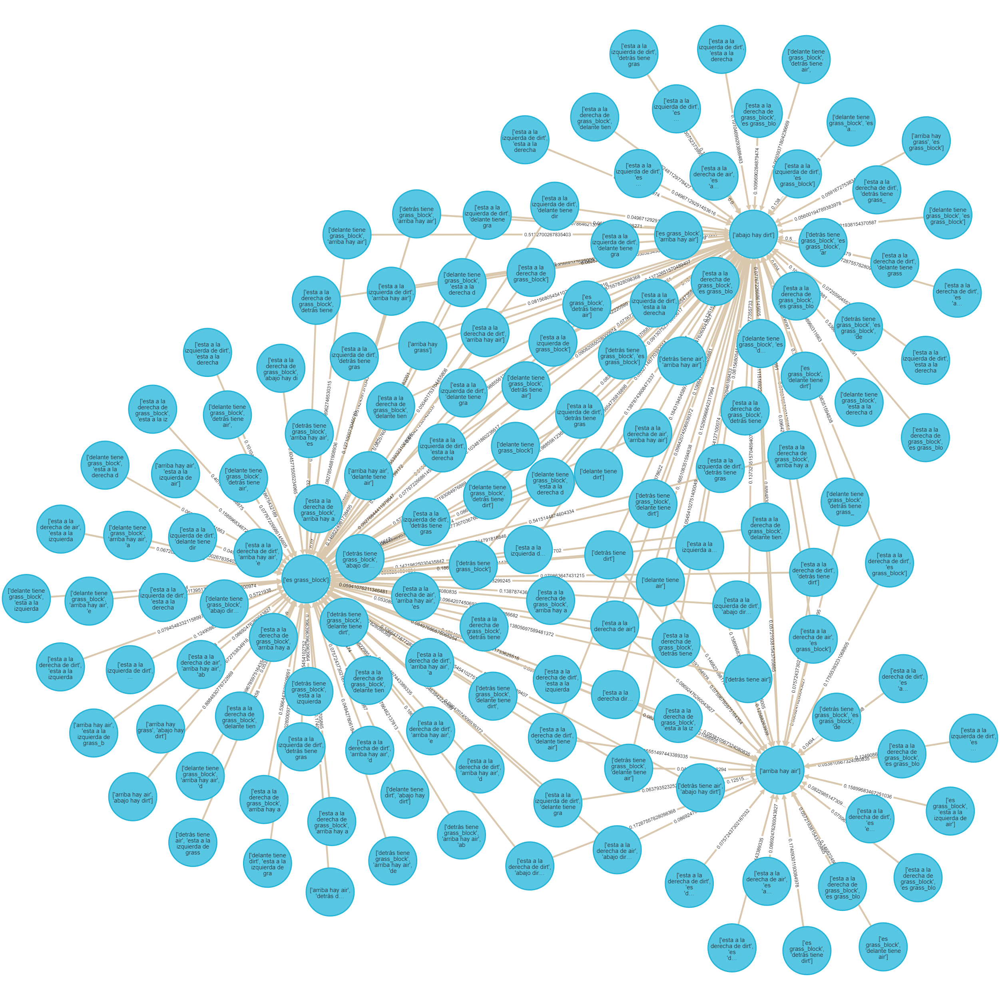

# Minería de reglas de asociación espacial sobre Minecraft

***Martín Cogo Belver***  

***Inteligenci Artificial I***

***Informe final***

***Facultad de Ingeniería Universidad de Cuyo***

## El Proyecto

Este proyecto tiene como objetivo la resolución de algún problema en particular y la justificación de la solución utilizando algoritmos de Inteligencia Artificial.

El problema que se eligió para este proyecto se puede explicar de la siguiente manera:

Dentro de la industria de creación de videojuegos existe un area grande e importante que consiste en la generación procedural. Se le llama generación procedural de contenido, o **PCG** (*Procedural Content Generation*) por sus siglas en ingles, a la creación algorítmica de contenido para videojuegos con entradas del usuario limitadas o indirectas. [Procedural Content Generation in Games].
Dentro de este area existen varios algoritmos que permiten la generación de contenido a partir de el establecimiento de parámetros de entrada que permiten al Diseñador orientar el funcionamiento del algoritmo. Teniendo en cuenta esta característica surge la pregunta:  

- ¿Sería posible mediante un algoritmo de inteligencia artificial y un entorno (artificial o natural), poder *inferir* parámetros para que un algoritmo de **PCG** genere entornos similares?  

O de otra manera:

- ¿Puedo ***inferir las relaciones*** que existen entre los objetos de un entorno dado y, a partir de ellos, establecer parámetros para un algoritmo de generación procedural?

Debido a la extension de un proyecto que abarque el procedimiento completo desde la obtención de los datos de un entorno hasta la generación de otro entorno mediante algún algoritmo *PCG* para contestar estas preguntas, se decidió que el enfoque del proyecto este en la búsqueda y comparación de algoritmos de inteligencia artificial que permitan la descripción, aprendizaje o inferencia de las relaciones que existen entre objetos en un espacio natural,artificial,físico o virtual.

Con la exploración bibliográfica se puede entender que existe un area de investigación dentro de la ciencia en minería de datos que enfocada en como realizar las tareas de minería de datos sobre bases de datos espaciales o geográficas. La **Minería de Datos Espaciales** o **SDM** es un proceso de descubrimiento y extracción de conocimiento generalizado sobre gran cantidad de datos espaciales. [Spatial Data Mining_ Theory and Application_Deren L., Shuliang W., Deyi L].

El proyecto entonces consistirá en la aplicación de algunas técnicas y algoritmos utilizados en el area de *Spatial Data Mining* para poder describir u obtener las relaciones entre objetos espaciales en un entorno. Como la obtención de datos de un entorno real, resulta complejo, y el enfoque inicial pretende abstraerse de objetos concretos, se opta por elegir un entorno practico para el proyecto. Concretamente, el entorno es una porción de mapa del Videojuego *Minecraft*.

*Minecraft* es un videojuego con gráficos 3D que utiliza un complejo procedimiento de generación procedural para la creación de terrenos de juego utilizando cubos. Principalmente es elegido debido a que los datos correspondientes a un terreno generado en el videojuego son de fácil acceso, fácil generación y la extracción de es sencilla, además, la disposición de los objetos dentro del juego son bloques con coordenadas rectangulares, es decir que el entorno esta grillado. Se puede obtener mas información sobre el procedimiento de generación procedural en está pagina web: [The World Generation of Minecraft].

### El trabajo

Los enfoques tomados para la *búsqueda de patrones*, según [Discovering Spatial Co-location Patterns],en datos espaciales se dividen en dos ramas:

- Los métodos basados en **estadística espacial** utilizan medidas de correlación espacial para caracterizar las relaciones entre los diferentes tipos de atributos espaciales. Computar las medidas de correlación espacial para todo posible patron de co-localización puede ser computacionalmente caro debido al numero exponencial de candidatos dado una gran cantidad de atributos espaciales.

- El enfoque basado en **reglas de association** se concentra en la creación de transacciones booleanas sobre el espacio de tal manera que se pueda usar el algoritmo ***apriori***.***(Estos son de nuestro interés para la resolución del problema)***

Con la exploración bibliográfica en libros como [Data Mining and Knowledge Discovery Handbook] y [Spatial Data Mining_ Theory and Application_Deren L., Shuliang W., Deyi L] podemos entender que relacionados con la tarea de la minería de datos existen modelos predictivos y descriptivos. Con el análisis del problema entendemos que los modelos con un enfoque descriptivo que podríamos utilizar son los modelos de Clustering o las Reglas de asociación.

En este trabajo optamos por el enfoque mediante un modelo de Reglas de Asociación. Si entendemos un poco más del entorno podemos notar que se encuentra totalmente generado por bloques de distinto tipo y cuyo posicionamiento cumple con un patron que nosotros buscamos descubrir a lo largo del trabajo. Si se utilizara un algoritmo de clustering los resultados que obtendríamos son grupos de bloques que son similares y no es el tipo de respuesta que se busca para la solución al problema.  

Teniendo en cuenta que el resultado esperado es un modelo que permita entender como se relaciona la posición de un bloque con la posición de otro bloque, se eligió el enfoque de Reglas de Asociación que esta basado principalmente en el algoritmo **Apriori**. Por lo tanto en este trabajo se generaran reglas de asociación con este algoritmo y se generaran gráficos que ilustren y permitan el análisis de resultados y obtención de una conclusion.

## Apriori Y Métricas

Con la investigación de la bibliografía sobre el area de Minería de datos espaciales [Spatial Data Mining_ Theory and Application_Deren L., Shuliang W., Deyi L] se nos brinda una definición formal del problema de minar datos transaccionales para generar reglas de asociación.

### Definición formal del problema

Sea $I = \{i_1,...,i_n\}$ un conjunto de *items*. Al conjunto que contiene *k* items se le llama conjunto *k* de items.  

Si $A \subseteq I,B \subseteq I$ y $A \cap B = \empty$, entonces las regla de asociación es una implicación de la forma $A \rightarrow B$.  

$D$ es el conjunto de datos transaccionales relevantes para la tarea de minería.Cada transacción $T$ con un identificador $TID$ es el conjunto permitiendo $T \subseteq I$.  

Un conjunto de items ***frecuente*** es uno donde la frecuencia de ocurrencia de los items no es menor que el **soporte mínimo** establecido y no menor que el numero de transaccionen de $D$.

El algoritmo *Apriori* utiliza información en conjuntos de items *frecuentes* para generar reglas de asociación. La idea básica es buscar en el conjunto de datos transaccionales varias veces para determinar los *conjuntos de items frecuentes*. Cada búsqueda después de la primera, tiene la prioridad de generar conjuntos de datos frecuentes candidato a partir del ultimo conjunto de datos frecuentes obtenido. La información a priori es utilizada para generar el primer conjunto frecuente.

### Métricas

- Soporte: Se trata de la probabilidad de que aparezca X e Y en las transacciones.
$$
Support({X}\to{Y})  = \dfrac
{\text{Transaction containing X and Y}}
{\text{Total number of transactions}}
$$

- Confianza: Mide la probabilidad de que aparezca el Y dado que en una transacción aparece X.

$$
Confidence({X}\to{Y})  = \dfrac
{\text{Transaction containing X and Y}}
{\text{Transactions containing X}}
$$

- Sustentación: El indicador lift expresa cuál es la proporción del soporte observado de un conjunto de productos respecto del soporte teórico de ese conjunto dado el supuesto de independencia. Un valor de $lift = 1$ indica que ese conjunto aparece una cantidad de veces acorde a lo esperado bajo condiciones de independencia. Un valor de $lift > 1$ indica que ese conjunto aparece una cantidad de veces superior a lo esperado bajo condiciones de independencia.. Un valor de $lift < 1$ indica que ese conjunto aparece una cantidad de veces inferior a lo esperado bajo condiciones de independencia.

$$
Lift({X}\to{Y})  = \dfrac{Confidence({X}\to{Y})}{Support(Y)}
$$

## Enfoques para el modelado de transacciones

Los problemas de co-localización espacial se ven similares a los clásicos pero de hecho son diferentes debido a la ausencia de transacciones.En el problema de minería de reglas de co-localización espacial, las transacciones son implícitas y además son disjuntos en el sentido de que no comparten instancias de tipos de item. Las instancias de atributos espaciales booleanos están embebidos en el espacio y comparten una variedad de relaciones espaciales unas con otras.

A partir de los los leído en el paper [Discovering Spatial Co-location Patterns], entendemos que en la minería de reglas de asociación existen casos especiales donde al menos uno de los predicados es espacial, lo cual nos lleva a la tarea de minería de reglas de asociación espacial. Si el descubrimiento de reglas de asociación espacial es restringido a un atributo de referencia, entonces las transacciones pueden ser definidas alrededor de instancias de este atributo. Generalizar este paradigma al caso donde no hay un atributo de referencia no es trivial. Una alternativa es la definición de transacciones particionando del espacio, aun que esto puede llevar al descuento de instancias de tuplas que intersecting los limites de las transacciones artificiales o recuentan instancias de tuplas que se encuentran juntas.  

En [Discovering Spatial Co-location Patterns] se definen dos términos para facilitar la descripción de los modelos.

- Una **co-localización** es un subconjunto de atributos espaciales booleanos.

- Una **regla de co-localización** es de la forma $C_1 \rightarrow C_2(p,cp)$ donde $C_1$ y $C_2$ son co-localizaciones, $p$ es un numero representando la medida de predominio y $cp$ es un numero que mide la probabilidad condicionada.

### Modelos para transacciones basadas en co-localización

Con el fin de tomar el conjunto de datos espaciales obtenidos compuesto por coordenadas rectangulares y modificarlos para que sirvan de entrada para el algoritmo **Apriori**. Se pretende utilizar algunos de los modelos siguientes.

#### Modelos

1. **Reference feature centric model**  
Es relevante para aplicaciones enfocadas en un atributo espacial booleano. El modelo enumera los *vecindarios* para "materializar" un conjunto de transacciones al rededor de instancias del atributo espacial de interés.  
Al "materializar" transactions, el **soporte** y la **confianza** de la minería tradicional son usados como *predominio* y medidas de *probabilidad condicionada*.  
  
En la imagen lo ques e puede apreciar es que siendo A el atributo de referencia, B y C los atributos relevantes, Entonces por cada atributo A se genera una transacción que depende de los B y los C cercanos o relativos. 
2. **Window centric model**  
Es relevante para aplicaciones que se enfocan en parcelas de territorio. Un objetivo es predecir un conjuntos de atributos espaciales que es probable descubrir en una parcela dado que se han encontrado otros atributos en el. El modelo enumera todas las posibles ventanas como transacciones.En espacios discretizados por grillas uniformes, las ventanas de $kxk$ se pueden materializar ignorando el efectos de limites. El **soporte** y la **confianza** se usan como *predominio* y medidas de *probabilidad condicionada*.
En este caso discretizando con un raster o grilla se generan particiones del terreno, e infinitas particiones pueden obtenerse con si se permite el solapamiento de ventanas.  
  
Se puede ver en la imagen una ventana de $3x3$ que tiene atributos A y C.
3. **Event centric model**  
Es relevante para aplicaciones donde hay muchos tipos de atributos espaciales booleanos. Se utiliza cuando es de interés encontrar subconjuntos de atributos espaciales probables a ocurrir en el vecindario alrededor de instancias dado subconjuntos de tipos de eventos.  
Hay más detalles respecto a este modelado en [Discovering Spatial Co-location Patterns]  
  

#### Otros modelos apreciados que se utilizan para la minería de reglas de asociación  

Más de talles de estos en [Spatial Data Mining_ Theory and Application_Deren L., Shuliang W., Deyi L].

1. **Concept lattice**  
El  lattice o (también llamado análisis de concepto) es un modelo para espacios grillados.En este contexto lattice hace referencia a una colección regular o irregular de lugares espaciales relacionados entre ci mediante una relación de vecindario. Un diagrama de Hasse simplemente visualiza la relación de generalización entre la intension y la extension de un concepto.  
Comparado con el Algoritmo Apriori ,el concepto lattice reduce el numero de reglas de asociación redundantes, dando como resultado un mejor rendimiento.

2. **Cloud model**  
En general, el conjunto frecuente de items de reglas de asociación espacial existen a un nivel conceptual alto, is difícil descubrirlas en un nivel conceptual bajo. En particular, cuando el atributo es numérico y la minería es sobre el nivel conceptual original. no se generan fuertes reglas de asociación si el soporte y confianza mínimo son grandes. En este caso los atributos necesitan ser elevándolas un nivel mediante generalización de atributos, y luego las reglas de asociación se deben generar sobre ellos. El modelo nube flexibiliza las particiones de atributos espaciales simulando  el lenguaje humano. Cada atributo es tratado como una variable lingüística.
Luego de la generalización varias tuplas pueden combinarse si se vuelven idénticas a un nivel conceptual alto, lo cual reduce el tamaño de los datos significativamente. Luego de este preprocesamiento se utiliza el algoritmo *Apriori*.

### Modelos para el trabajo

De todos los anteriores modelos, para este caso de aplicaciones solo tres son de nuestro interés. El **Reference feature centric model** que nos permite tomar un bloque en particular como atributo de referencia y generar reglas de asociación de el, el **Windows centric model** que nos resulta de muy fácil aplicación debido a que el mapa del videojuego ya se encuentra grillado en 3 dimensiones. Y (de manera tentativa), el **Cloud model** debido a que nos permite de alguna manera tomar el dominio de las coordinas rectangulares y generar expresarlo en lenguaje natural.

## Obtención de los datos del Videojuego

Para extraer la información sobre los bloques de Minecraft utilizare la información brindada por esta pagina web:[Minecraft Region file format](https://minecraft.fandom.com/wiki/Region_file_format).  

En la capeta de instalación del videojuego encontramos una carpeta donde se guarda la información cada mundo generado llamada ``saves``. Dentro de la carpeta del mundo encontramos la sub-carpeta ``region``. Esta carpeta contiene varios archivos con formato *.mca*. Los archivos *.mca* tienen un patron de nombramiento que depende de las regiones del juego que se han generado, por cada region generada existe un archivo que contiene la información de 32x32 *chunks*. Siendo *x* y *z* las coordenadas de una región los archivos se nombran como *r.x.z.mca*.

Cada *Chunk* guarda el terreno, las entidades en un area de 16x16x256 donde el ancho y largo es 16 y la altura es 256. Además guarda iluminación precomputalizada, mapas de altura y otra información que no es de nuestro interés. La estructura de los archivos .mca se ve de esta manera:  
  
*(Se puede apreciar que la diferencia entre los archivos .mca nuevos y viejos no es notable en la estructura general de almacenamiento)*

El terreno que utilizare fue generado por la version 1.10.2 del videojuego. Debido a que la herramienta de [Visualización](http://pessimistress.github.io/minecraft/) funciona con mapas generados en versiones del juego anteriores a la 1.14, y el paseador de archivos *.mca* [Anvil Parser] funciona con versiones posteriores a la 1.14. Se genera conflicto con los archivos generados por el videojuego.

Para solucionar este inconveniente y no crear un visualizador o un parcer nuevo, generé un mundo y sus correspondientes archivos *.mca* en la version 1.10 y luego **utilizando el videojuego** realizo una conversion del mapa a la version 1.14. De esta manera trabajaremos con los archivos *.mca* de la nueva version guardados en la carpeta *region_new* y visualizaremos los mapas con los archivos *.mca* guardados en la carpeta *region_old*. En escencia el **contenido de los archivos .mca es el mismo**, con la diferencia de que desde la version 1.14 cambian algunas particularidades de como se almacena la información en los archivos .mca.

Para "parsear" estos archivos y extraer la información de los bloques en un archivo de región utilizaremos la biblioteca **anvil**. Una vez parseado guardaremos el chunk en formato .csv y utilizaremos la biblioteca **pandas** para trabajar y manipular los datos.

## Análisis de reglas de asociación

La evaluación de reglas de asociación mediante las métricas **soporte** y **confianza** generalmente decantan en el caso en el que la regla es bien conocida o trivial, o en el caso en el que se generan gran cantidad de variantes de una misma regla con valores similares de confianza y soporte.

En el libro [Data Mining and Knowledge Discovery Handbook] se nos proveen enfoques para atacar este problema de los cuales nos interesa uno:

- **Búsqueda de soporte de reglas y navegación iterativa de reglas**

Para empezar, la decisión final de si una regla es de interés o no la realiza un experto. Las métricas constantemente retornan reglas como las más interesantes si tienen un solo item en el consecuente, porque en este caso la confianza se maximiza. Pero el usuario podría no estar interesado en diferentes items o combinaciones en el consecuente. Por eso el interés subjetivo de estas reglas puede ser bajo en algunas aplicaciones. En efecto, todas las medidas de interés se sustentan en propiedades estadísticas y no tienen en cuenta la información de fondo. El experto toma en cuenta reglas que resultan de interés pero no son distinguibles de las demás por sus métricas.  

Para facilitar la tarea de exploración de reglas de asociación en [Pruning and summarizing the discovered associations] se utiliza la correlación estadística para definir direcciones de una regla.  

## Podando reglas de asociación

La técnica primero realiza un poda sobre las reglas minadas para remover aquellas reglas insignificantes. El conjunto de reglas no podadas se llama *direction settings* (DS) *rules*, y debido a las pruebas en la practica, resulta ser un conjuntos de reglas pequeños. The **DS rules** da un resumen del comportamiento de las reglas descubiertas. Estas representan las relaciones esenciales del dominio.

### Chi-Square Test for Independence and Correlation

El método $X^2$ como estadístico de prueba es utilizado ampliamente para las pruebas de independencia o correlación. Escencialmente la prueba $X^2$ esta basada en la comparación de frecuencias observadas con la correspondiente frecuencia esperada. Mientras más cercana es la frecuencia observada a la esperada mayor es el peso de evidencia en favor de la independencia. Se trata de una prueba de hipótesis donde se utiliza el estadístico de bondad de ajuste.

[Pruning and summarizing the discovered associations] Se define:

- Definición 1:(correlacionado) Siendo $s$ el soporte mínimo y $c$ el nivel de significancia. $X$ e $y$ de la regla $X \to y$, se dice que $(s,c)$ están correlaciones si se cumplen las siguientes condiciones:
    1. El soporte $s$ de la regla excede
    2. El valor $X^2$ para la regla con respecto a el resto de los datos excede el valor $X^2$ a un nivel de $c$.

- Definición 2:(independiente) Siendo $s$ el soporte mínimo y $c$ el nivel de significacia. $X$ e $y$ de la regla $X \to y$, se dice que $(s,c)$ son independientes si se cumple:
    1. El soporte $s$ de la regla excede
    2. El valor de $X^2$ para la regla con respecto a el total de los datos no excede el valor $X^2$ a una significaría s.

- Definición 3:(tipo de correlación o dirección)
    1. Positive correlation: si $X$ e $y$ de una regla r $X\to y$ están correlacionados y $\frac{f_o}{f_e} > 1$, se dice que r tiene correlación positiva, se denota con 1 y decimos que la dirección de r es 1.
    2. Negative correlation: si $X$ e $y$ de una regla r $X\to y$ están correlacionados y $\frac{f_o}{f_e} < 1$, se dice que r tiene correlación negativa, se denota con -1 y decimos que la dirección de r es -1.
    3. Independencia: si $X$ e $y$ de una regla r $X\to y$ son independientes,se denota con 0 y decimos que la direccion de r es 0.

### Direction Setting Rules

- Definition 4:(direction setting rule) Una regla $r$ es un $DS$ si satisface las siguientes condiciones:
    1. Tiene dirección positiva 1
    2. Su dirección no es un elemento del conjunto de *direcciones esperadas*.
- Definition 5:(Direcciones esperadas) El conjunto *direcciones esperadas* de una regla r es definido como sigue:
    1. Si r es 1-condicional, el conjunto esperado de direcciones es {0}.
    2. Si r es k-condicional rule r ($k > 1$) de la forma:
        r: $a_1,a_2,...,a_k\to y$
    el conjunto de direcciones es computarizada como sigue:
    Vemos a r como una combinaciond e 2 reglas, una regla 1-condicional y una regla ($k-1$)-condicional con el mismo consecuente $y$:
        $$r_1: a_i \to y  r_{\text{rest}}: a_1,a_2,...,a_k \ to y$$
    donde $$\{a_1,a_2,...,a_j\}=\{a_1,a_2,...ma_k\}-\{a_i\}$$
    Las direcciones esperadas para esta combinación, denotada por $b$ y $E_i$ es definida como sigue:
    1. **Si** ($r_1.dir=r_{\text{rest}}.dir=1$) **entonces** $E_i=1$.
    2. **Si** ($r_1.dir=o \text{ y } r_{\text{rest}}.dir=1$) **o** ($r_1.dir=1 \text{ y } r_{\text{rest}}.dir=0$) **entonces** $E_i=1$.
    3. **Si** ($r_1.dir=o \text{ y } r_{\text{rest}}.dir=1$) **o** ($r_1.dir=1 \text{ y } r_{\text{rest}}.dir=0$) **entonces** $E_i=1$.
    4. **Si** ($r_1.dir=r_{\text{rest}}.dir=0$) **entonces** $E_i=0$.
    5. **otherwise** $E_i=\text{unknown}$

**Lemma**: Todos las reglas 1-condicionales que son correlativas son reglas DS All positively correlated 1-condition rules are
direction setting rules
La demostración se incluye en [Pruning and summarizing the discovered associations].

### El algoritmo

El algoritmo realiza la poda y la búsqueda de reglas $DS$. Los parámetros de entrada son $F$ y $T$, donde $F$ es el conjunto de reglas de asociación encontradas y $T$ es el valor $X^2$ con un nivel de significaría particular.

Dos puntos importantes:

1. En la definición de reglas $DS$ y $no-DS$, no se menciono como están relacionadas con el podado. Claramente, aquellas reglas podadas no se incluirán en el conjunto de reglas $DS$ o $no-DS$.
2. Para el fácil entendimiento el algoritmo se presenta como un método de pos-procesamiento pero puede incluirse durante la generación de reglas.

## Análisis de Datos de Entrada

A diferencia de el punto de vista de la minería de datos clásica, donde el conjunto de datos esta compuesto columnas llamados Atributos y cada linea llamada transacción, al trabajar con datos espaciales cada linea se interpreta como una entidad u objeto en el espacio y cada columna puede ser un atributo no espacial o un atributo espacial.

En este caso particular podemos ver que los atributos no espaciales son el **Tag** que es prácticamente el nombre del tipo de bloque que hay en el mapa y el atributo **Bid** que es un id de bloque relativo al *chunk* en el que está.

Los demás atributos resultan ser coordenadas rectangulares donde **cx** y **cz** son coordenadas en dos dimensiones que indican la posición del *chunk* al cual pertenece el bloque. Y los atributos **(X,Y,Z)** corresponden a las coordenadas rectangulares locales que indican el posicionamiento del bloque en su *chunk*. Todos estos atributos son espaciales y describen el objeto que en este caso es un bloque.

El mapa en el juego se ve de está manera:

  

Esta parte del mapa tiene algunas particularidades que son notables:
  
Se puede observar que cruza una pequeña porción de agua que esta rodeada por piedas, arena y grava. Corresponde con una pequeña parte de un río generado en el mapa.  
  
La porción del terreno cubierta con arboles tiene 3 tipos: 
Los de madera clara son robles, los de madera obscura son arboles de roble obscuro y ademas se pueden observar hongos grandes rojos y uno marron.  

  
Se pueden que en las capas inferiores pequeñas cuevas y lo que se conoce como una *grieta* en el juego. A mayor profundidad se puede observar mayor cantidad de minerales y bloques distintos a la piedra. En el ultimo nivel se puede ver que están los bloques denominados bedrock que delimitan el final del terreno y no pueden ser traspasados por los jugadores.

### Lista de tipos de bloques presentes en el conjunto de datos

Lista de tipos de bloque:

['bedrock' 'stone' 'gold_ore' 'diorite' 'andesite' 'coal_ore' 'dirt' 'grass_block' 'air' 'oak_log' 'oak_leaves' 'iron_ore' 'granite' 'redstone_ore' 'lava' 'gravel' 'dark_oak_leaves' 'grass' 'cave_air' 'dark_oak_log' 'oak_planks' 'oak_fence' 'lapis_ore' 'cobweb' 'rail' 'poppy' 'water' 'red_mushroom_block' 'diamond_ore' 'mushroom_stem'
'spawner' 'red_mushroom' 'infested_stone' 'emerald_ore' 'obsidian' 'sand''clay' 'spruce_leaves' 'spruce_log' 'dandelion' 'brown_mushroom_block' 'peony' 'sugar_cane' 'tall_seagrass' 'seagrass']

Claramente se aprecia en el gráfico que se trata de un conjunto de datos desbalanciados ya que los bloques de aire, piedra y tierra tienen frecuencias mucho más altas que todos los otros tipos, es de esperarse entonce que el soporte soporte de las reglas generadas a partir de estos tipos sean muy altos.

### Distribución de los bloques de aire en el mapa

- En estos gráficos podemos observar la distribución de los bloques de *aire* en azul y *aire de cueva* en color mas grisáceo. Se ve que a partir del la altura $Y = 70$ hay una gran cantidad de bloques de aire, estos corresponderían con el exterior, el cielo y el aire entre los arboles.

Como datos apartados podemos ver que hay bloques de *aire* debajo de la altura $Y = 70$. Estos bloques se encuentran en dentro de la grieta que se puede ver bajo tierra. También podemos ver que hay una porción de aire de cueva muy cercano a la superficie que corresponde con la entrada a alguna cueva desde la superficie.

### Distribución de la lava y el agua en el mapa

  
  
  

- Se puede Interpretar de estos gráficos que hay más *lava* mientras mas profundo o hacia abajo se va en el mapa. También se puede apreciar que el agua en las cuevas o bajo tierra tiende a desplazarse hacia abajo, mientras que la *lava* se acumula en grandes cantidades siempre bajo tierra.  
Como casos apartados podemos ve que hay un gran cúmulo de bloques de *agua* muy en la superficie que corresponde con el rio que se puede apreciar en las imágenes de arriba. También hay un gran cúmulo de *lava* que corresponde con el fondo de la grieta observada.

### Distribución de tierra y arboles en el mapa

- En estos gráficos podemos ver la distribución de la tierra,los arboles con sus hojas,la arena y arcilla. Lo más destacable de estos gráficos es que se puede ver que los troncos y hojas de los arboles están separados del suelo y la piedra por dos capas, la primera capa consiste de los bloques con pasto, y la segunda de varios bloques de tierra.  

- También se puede ver que donde hay arena no existen arboles por encima y también esta separada de las piedras por una capa de tierra. Si observamos bien la parte del mapa sin arboles es el valle donde se encuentra el rio y toda la arena y grava se encuentra principalmente alrededor y debajo de el.

- Finalmente la tierra se distribuye en cúmulos entre la piedra y se extiende prácticamente hasta las capas mas profundas.

### Detección de Outliers o datos espaciales apartados

Un *dato espacial aparatado* es un objeto especialmente referenciado cuyos atributos no-espaciales tienen valores que difieren significativamente de aquellos otros objetos que son vecinos. El análisis de datos aparatados resulta importante para el descubrimiento de patrones en los datos espaciales.

Existen dos tipos de métodos para la detección *valores apartados* en datos espaciales:

- **Graphical test** (Prueba gráfica): Metodos de ejemplo incluye el *variogram cloud* y el *Moran scatterplots*.  
- **Quantitative test** (Prueba cuantitativa): proveen una prueba precisa para la distinción de los datos apartados. los *Scatterplots* son representativos de esta técnica.  

Un **variogram-cloud** muestra puntos de datos relacionados por una relación de vecindad. por cada par de localizaciones, se plotea la raíz cuadrada de la diferencia absoluta entre los valores de los atributos de las localizaciones contra la distancia Euclideana entre las localizaciones. En conjuntos de datos que exhiben una fuerte dependencia espacial, la varianza en la diferencia entre atributos incrementara a medida que incrementa la distancia entre localizaciones.
Localizaciones que están cercanas una de la otra, pero tienen gran diferencia en sus atributos, deberían indicar un dato apartado, incluso si los valores de ambas localizaciones puedan aparentar ser razonables cuando se examinan los datos no espaciales.

- Debido a que los vecindarios, ventanas o en este caso *chunks* se encuentran de manera equidistante entre si, no es util utilizar métodos que sirven para la detección de datos apartados teniendo en cuenta el espacio. Debido a que las distancias entre dos bloques se tienden a repetir se puede ver que hay un patron en la distribución de los puntos en los gráficos. Pero no es claro donde existen datos apartados y donde no.  

## Generalización de el atributo tipo de bloque

Debido a que existen tipos de bloques que pueden generalizarse o abstraerse a un concepto mas general como por ejemplo oak_log y dark_oak_log que pueden agruparse en una categoría log. Realizar está abstracción nos dará reglas más generales, que serán mas fáciles de analizar.

En este caso agruparemos los tipos de bloques de esta manera:

- *igneous_rock* = {diorite,andesite,granite}
- *tree_log* = {oak_log,dark_oak_log,spruce_log}
- *tree_leaves* ={oak_leavesdark_oak_leaves,spruce_leaves}
- flower = {poppy,dandelion,peony}
- *seagrass* = {tall_seagrass,seagrass}
- *sedimentary_stone* = {sand,clay,gravel}
- *mushroom_block* ={red_mushroom_block,brown_mushroom_block,mushroom_stem}
- *planks_block* = {oak_planks}
- *fence* = {oak_fence}

## Elección de parámetros

El algoritmo Apriori necesita como entrada un soporte mínimo y una confianza minima para poder filtrar los posibles conjuntos de items generados. Entonces, ¿Qué valores deberían tomar estos parámetros?. Debido al tiempo que implicaría probar todos los posibles valores para concluir en algún valor optimo o conveniente paso a realizar el siguiente razonamiento:

Voy a considerar en este trabajo que una patron es un patron valido si este aparece como mínimo un total de 100 veces o más. Con esto podremos calcular el soporte mínimo en función del la cantidad de transacciones en el conjunto de entrada.
La confianza nos indica que tan probable es que ocurra el consecuente dado que se cumple el antecedente. Necesitamos entonces que este valor sea alto para poder asegurarnos que realmente es un patrón y no una coincidencia. Elegiré entonces un valor de confianza del 90%.

## Creación de transacciones a partir de datos espaciales

### Window centirc model

#### Transacciones de ventanas de 4x4x4 sin solapamiento

Las transacciones para en este caso son ventanas de 4x4x4 es decir cubos de 64 bloques. Para la generación de estas reglas pasamos como parámetro un soporte mínimo de 0.00001 y una confianza de 90%. Utilizamos estos parámetros debido a que el conjunto de bloques del juego se encuentra desbalanciado *(la cantidad de bloques de aire, piedra y tierra tienen frecuencias altas comparado a los demás bloques)*, si no colocásemos un soporte mas pequeño que 0 las reglas generadas no mostrarían las relaciones que existen entre aquellos bloque que menos hay en el mapa, y  el enfoque de nuestro problema lo que buscamos es encontrar la mayor cantidad de relaciones entre los objetos del mapa posible. Y utilizamos una confianza alta ya que al tratarse de una generación aleatoria no todos las relaciones que existen se repetirán lo suficiente como para que sean patrones validos.

Realmente este enfoque para modelar las transacciones no nos resulta de gran interés, ya que simplemente nos muestra que bloque existe en una ventada dado que otro existe en ella. Si bien es notorio que existe un patron, no podemos saber claramente como es el patrón claramente.
Entonces el **windows centric model** no es un modelo que nos permita obtener las reglas que se buscan.

#### Grafo general de reglas de asociación

  

Podemos observar que se trata de un grafo totalmente conexo, donde cada nodo representa un antecedente o consecuente de una regla. Al tratarse de un grafo muy grande y cantidad de reglas es grande. Resulta muy difícil analizarlo. Simplemente podemos marcar algunos pequeños clusters que se forman alrededor de nodos particulares, los cuales se puede apreciar que siempre tienen un solo tipo de bloque, ej. air,dirt, water o stone.

#### Grafo de reglas DS  

  

Este grafo es el resultado del post-procesamiento y se trata de las reglas que forman el direction setting set o DS. Estas son las reglas que representan y dan dirección a la mayoría de las demás reglas que se encuentran en non-DS rules. El análisis resulta sencillo en este grafo.
Podemos ver entonces los siguientes patrones:

Claramente estas reglas no se encuentran en el conjunto de reglas DS pero si representan bien todas las posibles variaciones que pueden formarse (varios de ellos se encuentran en el conjunto non_DS).

Observando las primeras reglas podemos ver que la confianza es muy alta en todas pero el soporte no necesariamente. Esto se interpreta como que el consecuente ocurre muy frecuentemente cuando el antecedente se cumple pero ambos antecedente y antecedente ocurren poco frecuentemente juntos en la misma venta.(De todas maneras el soporte es tan bajo debido a la enorme cantidad de bloques y lo desbalanceado que se encuentra el conjunto de bloques). Sin embargo podemos asegurar que cada una de estas reglas ocurre almeno 100 veces o más.

    id           antecedants      =>      consequents   support  confidence  
    0            ['coal_ore']  ['=>']        ['stone']  0.050830    1.000000   
    1                ['lava']  ['=>']        ['stone']  0.006641    1.000000   
    2         ['tree_leaves']  ['=>']          ['air']  0.028857    1.000000   
    3               ['grass']  ['=>']  ['grass_block']  0.008057    0.906593   
    4         ['grass_block']  ['=>']         ['dirt']  0.024414    0.902527   
    5            ['iron_ore']  ['=>']        ['stone']  0.054346    1.000000   
    6   ['sedimentary_stone']  ['=>']        ['stone']  0.025244    0.966355   
    7            ['tree_log']  ['=>']          ['air']  0.023584    0.997934   
    8            ['cave_air']  ['=>']        ['stone']  0.029443    0.982085   
    9         ['grass_block']  ['=>']          ['air']  0.024951    0.922383   
    10       ['planks_block']  ['=>']        ['stone']  0.007275    1.000000   
    11           ['gold_ore']  ['=>']        ['stone']  0.006006    1.000000   
    12              ['fence']  ['=>']        ['stone']  0.005811    1.000000   
    13              ['fence']  ['=>']     ['cave_air']  0.005811    1.000000   
    14       ['redstone_ore']  ['=>']        ['stone']  0.014307    1.000000   
    15       ['igneous_rock']  ['=>']        ['stone']  0.179639    0.997019   
    16              ['grass']  ['=>']          ['air']  0.008887    1.000000   
    17       ['planks_block']  ['=>']     ['cave_air']  0.007275    1.000000   
    18            ['bedrock']  ['=>']        ['stone']  0.031152    1.000000

#### Grafo de reglas no DS

- En este conjunto se encuentran todas las demás reglas que podrían ser relevantes aun que su análisis nos revelaría que las reglas son combinaciones de todas las reglas anteriores.

- Aun asi no hay que desmerecer la importancia de los patrones que pueden hallarse en este grafo aunque sean de difícil interpretación debido a su cantidad.

Cabe destacar que existen patrones que ocurren menos de 100 veces y que resultan importantes por ejemplo

- Si hay *piedra* y *lava* y *agua* **entonces** hay *obsidiana*.

Esto nos lleva a pensar que definir una cantidad minima de veces para que aparezca un patron no es tal vez la mejor forma de encarar el problema.

Realmente este enfoque para modelar las transacciones no nos resulta de gran interés, ya que simplemente nos muestra que bloque existe en una ventada dado que otro existe en ella. Si bien es notorio que existe un patron, no podemos saber claramente como es el patrón claramente. 
Entonces el **windows centric model** no es un modelo que nos permita obtener las reglas que se buscan.

### Reference feature centric model

Transacciones con ventanas de la forma cruz con 7 bloques, se pueden visualizar de la siguiente manera:  
  
Con este tipo de modelado de transacciones podemos obtener reglas que tienen una forma más cercana a las reglas que esperamos generar.

#### Atributo de referencia **diamante**

En este caso con el debido análisis se pueden detectar ciertos patrones al rededor de los bloques de diamante. Si bien la idea era considerar que un patrón es valido si ocurre más de 100 veces en este caso solo hay 75 bloques de diamante por lo que es necesario bajar la cantidad. Asumimos entonces que la cantidad minima de veces es 12.

#### Grafo general de reglas de asociación

  

Podemos observar que se trata de un grafo totalmente conexo. Se puede observar que todos los nodos tienden a estar conectados con el item [es diamond_ore] y esto tiene sentido pues es aquel item que esta presente en todas las transacciones.

En las cuatro esquinas se puede ver que están los items [delante tiene stone], [detras tiene stone], [a la derecha de stone] y [a la izquierda de stone], lo cual nos hace entender que también esta presente en varias transacciones. Es decir, los diamante tienden a estar rodeados de piedras.

#### Grafo de reglas DS

  

En este caso las reglas que tienden a representar el resto de las reglas son 4 todas con una confianza alta y un lift que indica una correlación positiva. Estas reglas nos indican que existe una relación o patrón fuerte entre el diamante y la piedra,

                            antecedants      =>    consequents   support  confidence      lift 
0            ['detrás tiene diamond_ore']  ['=>']  ['delante tiene stone']  0.253333    0.791667  1.696429
1               ['abajo hay diamond_ore']  ['=>']  ['arriba hay stone']  0.186667    0.823529  1.470588
2  ['esta a la izquierda de diamond_ore']  ['=>']  ['esta a la derecha de stone']  0.240000    0.857143  1.648352 
3           ['delante tiene diamond_ore']  ['=>']  ['detrás tiene stone']  0.253333    0.791667  1.562500 

#### Grafo de reglas no DS 

Mirando este grafo notamos que todas pueden ser generadas tranquilamente por con las 4 reglas del conjunto DS. Y no nos aportan mayor información

#### Atributo de referencia **hojas y troncos**

En este caso trabajaremos con bloques de tipo tronco y hojas, para centrarnos al crear las transacciones.

#### Grafo de reglas reglas de asociación

  

Se ven que hay clusters alrededor de los items [arriba hay tree_leaves], [es tree_leaves], [abajo hay tree_log] , [es tree_log] y [arriba hay tree_log].
La idea de este análisis es obtener el patron que hay al generar arboles.  

  

                                antecedants      =>              consequents  
    0               ['arriba hay tree_leaves']  ['=>']       ['es tree_leaves']   0.455034    0.905123  1.181455
    1                       ['abajo hay dirt']  ['=>']          ['es tree_log']   0.023935    1.000000  4.275491
    2            ['delante tiene tree_leaves']  ['=>']       ['es tree_leaves']   0.547047    0.923572  1.205537
    3     ['esta a la derecha de tree_leaves']  ['=>']       ['es tree_leaves']   0.546787    0.918159  1.198471
    4             ['detrás tiene tree_leaves']  ['=>']       ['es tree_leaves']   0.547047    0.923032  1.204831
    5                  ['arriba hay tree_log']  ['=>']          ['es tree_log']   0.185153    0.982513  4.200724
    6   ['esta a la izquierda de tree_leaves']  ['=>']       ['es tree_leaves']   0.546787    0.925301  1.207793
    7                        ['abajo hay air']  ['=>']       ['es tree_leaves']   0.251930    0.922515  1.204157
    8                       ['abajo hay dirt']  ['=>']  ['arriba hay tree_log']   0.023935    1.000000  5.306489
    9                ['abajo hay tree_leaves']  ['=>']       ['es tree_leaves']   0.455034    0.992810  1.295912
    10                      ['arriba hay air']  ['=>']       ['es tree_leaves']   0.307085    0.996623  1.300889

Se ven claro los patrones en este conjunto:
- El patrón que indica que si hay un bloque de tierra abajo se trata de un tronco y arriba tiene otro tronco. 
- El patrón que indica que si hay una hoja esta rodeada de hojas y que arriba puede haber aire.

Llama la atención que los troncos y las hojas no estén relacionados de ninguna manera.

 

En este resto de reglas se puede ver los patrones:

- El patrón que indica que los troncos pueden estar rodeados de aire o rodeados por alguna hoja o tronco.
- El patrón de que las hojas están rodeadas de otras hojas arriba tienen aire y en algún costado un tronco.

#### Atributo de referencia **pasto**

En el caso de los bloques de pasto la cantidad minima de patrones que se debe encontrar es de 200, el soporte mínimo se define en función de esto.

#### Grafo de reglas reglas de asociación

  

Se puede ver que los las reglas tienden a relacionarse con 3 items en particular son: [es grass_block], [abajo hay dirt] y [arriba hay air].

Esto muestra un claro patron que indica que para que haya un bloque de tierra con pasto, debajo tiene más tierra y por arriba tiene bloques de aire.

  

Se puede apreciar el patrón antes mencionado en este conjunto resumido de reglas:

                                antecedants      =>         consequents  support  confidence      lift
    0            ['esta a la derecha de air']  ['=>']  ['abajo hay dirt']   0.096421    1.000000  1.011576 
    1                      ['arriba hay air']  ['=>']  ['abajo hay dirt']   0.888483    0.989962  1.001422 
    2                   ['delante tiene air']  ['=>']  ['arriba hay air']   0.146822    0.949606  1.058066
    3  ['esta a la izquierda de grass_block']  ['=>']  ['abajo hay dirt']   0.605308    0.991623  1.003103
    4            ['detrás tiene grass_block']  ['=>']  ['abajo hay dirt']   0.573655    0.993255  1.004753
    5          ['esta a la izquierda de air']  ['=>']  ['arriba hay air']   0.158997    0.956076  1.065275
    6                   ['detrás tiene dirt']  ['=>']  ['arriba hay air']   0.174093    0.934641  1.041391 
    7           ['esta a la derecha de dirt']  ['=>']  ['arriba hay air']   0.175554    0.926735  1.032583
    8         ['esta a la izquierda de dirt']  ['=>']  ['abajo hay dirt']   0.138787    0.976027  0.987326

 

Este grafo nos muestra que el bloque de pasto tiende a estar rodeado de otros bloques de pasto o tierra sin pasto.

Esta claro que el patrón donde arriba de una grass_block aparecen flores tiene una frecuencia muy pequeña como para que aparezca en las reglas, pero aún así se trata de un patrón totalmente valido y no descubierto. Esto nos hace pensar si realmente estamos tomando un acercamiento correcto  al problema.

### Combinación entre los modelos anteriores

Con los resultados obtenidos mediante los dos modelos anteriores, uno tendería querer combinar la forma que toman las reglas como resultado de el *reference feature centric model* y aplicarlo en todo el espacio como con el *window centric model*.

Debido a que la cantidad de tiempo necesario para generar las ventanas en cruz para cada bloque del mapa es grande, nos de dictaremos a el análisis y exploración de las reglas generadas para un solo chunk que son un total de $16x16x256 = 65536$  bloques.

Por lo tanto generaremos las transaccione para todos los bloques con ventanas tipo cruz que se superpondrán en todo el espacio.

La cantidad minima de patrones que se necesitaran para considerarlo valido es 200.

#### Grafo de reglas reglas de asociación

  

Se ven un cluster donde se relacionan los items con bloques de aire, por otro lado los que se relacionan con bloques de piedra, un cluster relacionado a las igneous_rocks (arena,arcilla o grava) y otro gran cluster relacionado con tierra.

  

En este caso se mantienen 3 clusters que muestra el patrón que indica:

- Que el aire tiende a estar rodeado de más aire Este patrón tiende a aparecer una enorme cantidad de veces (por eso ese cluster es un tipo todos contra todos).
- Que la piedra esta rodeada de más piedra
- y que la tierra esta rodeada de tierra o tiene bloques de pasto encima.

Esta información no es novedosa y explica muy poco respecto a todos los patrones que existen en un chunk del mapa Minecraft.

Se puede correr apriori con un soporte mínimo mucho menor al que se ha dado pero la el tiempo de ejecución crece exponencialmente.

## Conclusión

Con todas las pruebas y los distintos acercamientos podemos ver que si bien **Apriori** puede adaptarse a nuestro problema, no termina siendo lo más conveniente sobre todo por que nos encontramos limitados por el tamaño de las ventas, y el valor del soporte mínimo. Se puede ver también que basándonos unicamente en la estadística en este problema los patrones que resultan de nuestro interés, si son poco frecuentes comienzan a mezclares y a ser indistinguibles con aquellas coincidencias que se generan con la generación aleatoria y procedural.

La cantidad de patrones evidentes que existen en un mapa de Minecraft en este caso han resultado difíciles de obtener, y no solo eso, sino que el análisis de los resultados no es del todo Comodo o sencillo para la evaluación del rendimiento de las pruebas. Sería entonces necesaria una gran cantidad de poder de computo para generar gran cantidad de transacciones y ventanas de multiples tamaños y características que detecten patrones particulares, y ademas la búsqueda de una manera eficiente de evaluar el interés o la utilidad de las reglas generadas.

Debido a todas las complicaciones que se han  presentado durante el proyecto es evidente que la búsqueda de otro tipo de acercamiento para solucionar el problema empleando inteligencia artificial es necesario.

Aún así los mejores resultados fueron obtenidos mediante el modelo *centric feature model* que nos permite captar el comportamiento de un tipo de bloque a partir del análisis del entorno. Probablemente si se buscasen mejores resultados siguiendo la linea de las reglas de asociación y el algoritmo apriori, seria en linea con respecto al *centric feature model* y generación de ventanas mejores para describir extensivamente el terreno.

En este proyecto no hemos tomado muy en cuenta las coordenadas rectangulares del entorno para la inferencia de reglas, pero es lógico pensar que existen patrones que dependen enteramente de esto. Por ejemplo el patrón que indica que los bloques de diamante se generan por debajo de la altura $Y = 16$ y mayor a $Y = 2$.

## Bibliografía y Papers relacionados  

[Anvil Parser]:(https://github.com/matcool/anvil-parser)
[The World Generation of Minecraft]:https://www.alanzucconi.com/2022/06/05/minecraft-world-generation/
[Pruning and summarizing the discovered associations]:https://www.semanticscholar.org/paper/Pruning-and-summarizing-the-discovered-associations-Liu-Hsu/b0b4355014a05891108b9f315164619e698de788
[Discovering Spatial Co-location Patterns]:https://link.springer.com/chapter/10.1007/3-540-47724-1_13
[Spatial Data Mining_ Theory and Application_Deren L., Shuliang W., Deyi L]:https://link.springer.com/book/10.1007/978-3-662-48538-5
[Data Mining and Knowledge Discovery Handbook]:https://link.springer.com/book/10.1007/b107408
[Procedural Content Generation in Games]:https://link.springer.com/book/10.1007/978-3-319-42716-4

### Fuentes Primarias

#### Data Mining

- [Data Mining and Knowledge Discovery Handbook]

#### Spatial Data Mining

- [Spatial Data Mining_ Theory and Application_Deren L., Shuliang W., Deyi L]

- [Discovering Spatial Co-location Patterns]

#### Summarizing discovered rules

- [Pruning and summarizing the discovered associations]

### Fuentes Secundarios

#### Association Rules mining

- [Métricas para reglas de association](https://towardsdatascience.com/association-rules-2-aa9a77241654)
- [Priori en R](https://www.geeksforgeeks.org/association-rule-mining-in-r-programming/#:~:text=Association%20Rule%20Mining%20in%20R%20Language%20is%20an%20Unsupervised%20Non,in%20a%20transaction%20or%20relation.)
- [Lista de algoritmos para minería de reglas de asociación](https://personal.ntu.edu.sg/assourav/Unpublished/UP-ARMSurvey.pdf)

#### Spacial Association Rules mining

- [Enhancing spatial association rule mining in geographic databases](https://www.lume.ufrgs.br/handle/10183/7841)
- [POWERPOINT Spatial Association Rules](https://www.ismll.uni-hildesheim.de/lehre/spatial-09w/script/association_web.pdf)
- [Papers del Power anterior](http://www.spatial.cs.umn.edu/paper_list.html)
- [SPADA system for spatial association rules mining on spatial databases](https://edz.bib.uni-mannheim.de/www-edz/pdf/eurostat/02/KS-CS-02-001-EN-N-EN.pdf#page=26)
- [Discovering spatial interaction patterns of near repeat crime by spatial association rules mining](https://www.nature.com/articles/s41598-020-74248-w)
- [Exploring spatial data](https://libraries.mit.edu/files/gis/exploring_spatial_patterns_iap2013.pdf)

#### Procedural generation

- [Procedural Content Generation in Games]

#### Minecraft related content

- [The World Generation of Minecraft]  

- [JS chunk visualizer](https://pessimistress.github.io/minecraft/)
- [I Wrote a 3D Chunk Visualizer for Minecraft](https://www.youtube.com/watch?v=fpGsOdxcU2M&ab_channel=ParametricCamp)
- [An easy to use and fast Minecraft world viewer](https://unmined.net)
- [enkiMI Minecraft 3D editor](https://www.reddit.com/r/VoxelGameDev/comments/8c4a67/a_better_way_to_extract_minecraft_data/)
- [Minecraft Region file format](https://minecraft.fandom.com/wiki/Region_file_format)
- [Minecraft Region file Wikipedia](https://wiki.vg/Region_Files)
- [Formato NBT](https://minecraft.fandom.com/es/wiki/Formato_NBT)
- [Anvil Parser]